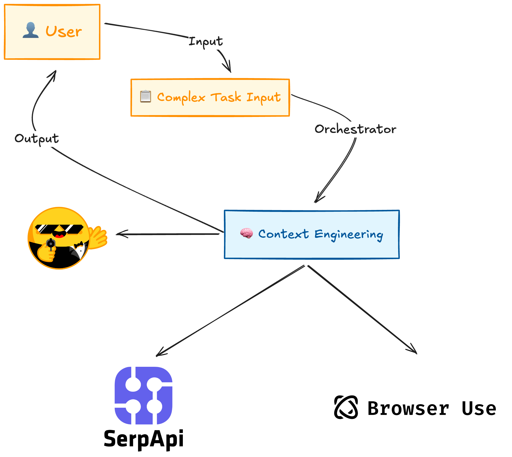

# 🤖 Agentic Internet

An advanced AI agent system powered by [smolagents](https://github.com/huggingface/smolagents) for autonomous internet interactions, research, and intelligent task execution.

## ✨ Features

- **🔍 Web Search & Scraping**: Search the web, scrape content, and gather information
- **🌍 Browser Use**: Interact with websites, fill forms, click buttons, and extract structured data in the cloud using the Browser Use Cloud SDK
- **📰 News Analysis**: Find and analyze recent news on any topic
- **💻 Code Execution**: Execute Python code safely in a sandboxed environment
- **📊 Data Analysis**: Analyze datasets and generate insights
- **🔬 Research Agent**: Conduct multi-depth research on any topic
- **🛠️ Extensible Tools**: Easy to add custom tools and capabilities
- **💬 Interactive Chat**: Chat interface for continuous interaction
- **🎨 Rich CLI**: Beautiful command-line interface with rich formatting
- **🚀 Multi-Model Orchestration**: Strategic model assignment for specialized tasks
- **🌐 SerpAPI Integration**: Advanced search with Google, Bing, Yahoo, Scholar, Maps, Shopping
- **🧠 Context Engineering**: Intelligent context management and memory systems
- **📈 Cross-Engine Validation**: Compare results across multiple search engines

## 🚀 Quick Start

### Process
The core process of the Agentic Internet is as follows:




### Installation

```bash
# Clone the repository
git clone https://github.com/AgenticInternet/agentic-internet.git
cd agentic-internet

# Install with uv (recommended)
uv sync

# Or install with pip
pip install -e .
```

### Environment Setup

Create a `.env` file in the project root:

```env
# Optional: For HuggingFace models
HUGGINGFACE_TOKEN=your_huggingface_token

# Optional: For OpenAI models (GPT-4, etc.)
OPENAI_API_KEY=your_openai_api_key

# Optional: For Anthropic models (Claude)
ANTHROPIC_API_KEY=your_anthropic_api_key

# Optional: For SerpAPI advanced search
SERPAPI_API_KEY=your_serpapi_key

# Optional: For multi-model orchestration via OpenRouter
OPENROUTER_API_KEY=your_openrouter_key

# Optional: For Browser Use (Browser Use Cloud SDK)
BROWSER_USE_API_KEY=your_browser_use_key
```

### Basic Usage

```python
from agentic_internet import InternetAgent

# Create an agent
agent = InternetAgent()

# Run a task
result = agent.run("Search for the latest AI news and summarize the top 3 stories")
print(result)

# Start interactive chat
agent.chat()
```

## 📚 CLI Commands

```bash
uv run python -m agentic_internet.cli --help
```

```bash
                                                                                                                                                                                
 Usage: python -m agentic_internet.cli [OPTIONS] COMMAND [ARGS]...                                                                                                              
                                                                                                                                                                                
 Advanced AI agent for intelligent internet interactions                                                                                                                        
                                                                                                                                                                                
╭─ Options ────────────────────────────────────────────────────────────────────────────────────────────────────────────────────────────────────────────────────────────────────╮
│ --help          Show this message and exit.                                                                                                                                  │
╰──────────────────────────────────────────────────────────────────────────────────────────────────────────────────────────────────────────────────────────────────────────────╯
╭─ Commands ───────────────────────────────────────────────────────────────────────────────────────────────────────────────────────────────────────────────────────────────────╮
│ chat          Start an interactive chat session with the agent.                                                                                                              │
│ run           Run a single task with the agent.                                                                                                                              │
│ research      Conduct research on a specific topic.                                                                                                                          │
│ config        Manage configuration settings.                                                                                                                                 │
│ multi         Run a task using the multi-model orchestration system.                                                                                                         │
│ orchestrate   Execute complex tasks using model orchestration.                                                                                                               │
│ tools         Manage and display available tools.                                                                                                                            │
│ news          Search and analyze news articles.                                                                                                                              │
│ models        List and manage available AI models.                                                                                                                           │
│ version       Display version information.
╰────────────────────────────────────────────────────────────────────────────────────────────────────────────────────────────────────────────────────────────────────────────────╯
```

### Interactive Chat

```bash
# Start chat with default model
uv run python -m agentic_internet.cli chat --verbose

# Use a specific model
uv run python -m agentic_internet.cli run "Write a short story on GPT-5 models" --model gpt-5.2 --verbose

# Quiet mode (less verbose)
uv run python -m agentic_internet.cli run "Describe the latest AI breakthroughs" --model gemini-3-flash --verbose --quiet
```

### Run Single Task

```bash
# Run a task
uv run python -m agentic_internet.cli run "Search for Python tutorials" --verbose

# Save output to file
uv run python -m agentic_internet.cli run "Analyze crypto market trends" --output results.txt --verbose

# Specify model and iterations
uv run python -m agentic_internet.cli run "Complex research task" --model claude-opus-4.5 --max-iterations 15 --verbose
```

### Research Mode
```bash
# Quick research
uv run python -m agentic_internet.cli research "quantum computing" --depth quick

# Deep research with output
uv run python -m agentic_internet.cli research "AI ethics" --depth deep --output research.md

# Output as JSON
uv run python -m agentic_internet.cli research "climate change" --format json --output data.json
```

### Multi-Model Orchestration

```bash
# Multi-model task
uv run python -m agentic_internet.cli multi "Analyze the impact of AI on healthcare" --models gpt-5.2 --models claude-opus-4.5 --workers 3 --output results.json

# News analysis
uv run python -m agentic_internet.cli news "artificial intelligence breakthroughs" --time 7d --sources "TechCrunch" --sources "Wired" --limit 20 --format markdown --output news_report.md
```

### Orchestrated Task

```bash
# Orchestrated task
uv run python -m agentic_internet.cli orchestrate "Develop a business plan for an AI startup" --coordinator gpt-5.2 --workers claude-opus-4.5 --output business_plan.json
```


### Other Commands
```bash
# List available tools
uv run python -m agentic_internet.cli tools --list

# Show configuration
uv run python -m agentic_internet.cli config --show

# Version info
uv run python -m agentic_internet.cli version
```

## 🛠️ Available Tools

```bash
# List all models
uv run python -m agentic_internet.cli models --list

# Show models by category
uv run python -m agentic_internet.cli models --category news

# Show detailed information
uv run python -m agentic_internet.cli models --details
```

## Tools

```bash
uv run python -m agentic_internet.cli tools
```

```bash
web_search
  
    Search the web for information using SerpAPI (if available) or DuckDuckGo.
    Input should be a search query string.
    Returns a list of search results with titles, snippets, and URLs.
    

web_scraper
  
    Scrape and extract text content from a web page.
    Input should be a URL to scrape.
    Returns the extracted text content from the page.
    

news_search
  
    Search for recent news articles on a topic.
    Input should be a search query string.
    Returns recent news articles with titles, descriptions, and sources.
    

browser_use
  Advanced browser automation tool for interacting with websites, filling forms, 
    clicking buttons, and extracting structured data. Use this when you need to interact with 
    dynamic websites or perform complex web automation tasks.

async_browser_use
  Async browser automation tool for high-performance web interactions. 
    Use this for complex scraping tasks that require parallel execution or streaming updates.

structured_browser_use
  Browser automation with structured data extraction. 
    Use this when you need to extract specific structured information from websites.

python_executor
  
    Execute Python code and return the output.
    The code should be valid Python that can be executed.
    Available libraries: numpy, pandas, requests, datetime, json, re, math.
    Returns the output of the code execution or any errors.
    

data_analysis
  
    Perform data analysis on CSV or JSON data.
    Input should be a dictionary with 'data' (string of CSV/JSON) and 'operation' (what to analyze).
    Returns analysis results including statistics, summaries, or visualizations.

```
### Web Tools

- **web_search**: Search the web using DuckDuckGo
- **web_scraper**: Scrape and extract content from web pages
- **news_search**: Search for recent news articles
- **multi_model_serpapi**: Multi-model SerpAPI tools
- **browser_use**: Browser Use Cloud SDK

### Code & Data Tools
- **python_executor**: Execute Python code safely
- **data_analysis**: Analyze CSV/JSON data
- **calculator**: Perform mathematical calculations

### Multi-Model SerpAPI Tools

```bash
uv run python -m agentic_internet.cli tools --multi
```

```bash
╭────────── Tools ──────────╮
│ Multi-Model SerpAPI Tools │
╰───────────────────────────╯

GoogleSearchTool
  Search the web using Google

GoogleShoppingTool
  Search for products and prices

GoogleMapsLocalTool
  Find local businesses and places

GoogleScholarTool
  Search academic papers and citations

MultiEngineSearchTool
  Search across multiple search engines
```

## 💡 Examples

### Web Research
```python
from agentic_internet import ResearchAgent

researcher = ResearchAgent()

# Conduct research at different depths
result = researcher.research(
    topic="Artificial General Intelligence",
    depth="deep"  # Options: quick, moderate, deep
)

print(result['findings'])
```

### Data Analysis
```python
from agentic_internet import InternetAgent

agent = InternetAgent()

data = """
[
    {"month": "Jan", "revenue": 10000, "costs": 6000},
    {"month": "Feb", "revenue": 12000, "costs": 7000},
    {"month": "Mar", "revenue": 15000, "costs": 8000}
]
"""

result = agent.run(f"Analyze this data and calculate profit margins: {data}")
```

### Multi-Step Tasks
```python
agent = InternetAgent(max_iterations=20)

complex_task = """
1. Search for the latest SpaceX launch
2. Find related news articles
3. Summarize the mission objectives
4. Analyze public sentiment from the news
"""

result = agent.run(complex_task)
```

### 🚀 Multi-Model Orchestration (Advanced)

The system includes an advanced multi-model orchestration system that strategically assigns different models to specialized tasks:

```python
import asyncio
from agentic_internet import MultiModelSerpAPISystem

# Initialize multi-model system
orchestrator = MultiModelSerpAPISystem(
    serpapi_key="your_serpapi_key",  # For advanced search
    context_window_size=32768  # Large context window
)

# Setup specialized workers
orchestrator.setup_multi_model_workers()

# Execute complex workflow
async def run_analysis():
    result = await orchestrator.execute_multi_model_workflow(
        "Conduct comprehensive market analysis for AI coding assistants",
        timeout=1200  # 20 minutes
    )
    return result

# Run the analysis
result = asyncio.run(run_analysis())
```

#### Available SerpAPI Tools:
- **google_search**: Advanced Google search with filters
- **google_shopping**: Product search with pricing
- **google_maps_local**: Local business search
- **google_scholar**: Academic paper search
- **multi_engine_search**: Cross-engine comparison (Google, Bing, Yahoo, Baidu)

#### Specialized Agents:
- **search_researcher**: Multi-engine research specialist
- **ecommerce_analyst**: E-commerce and pricing analysis
- **local_business_analyst**: Local market intelligence
- **academic_researcher**: Academic research and citations
- **competitive_analyst**: Strategic competitive intelligence
- **market_synthesizer**: Comprehensive market synthesis

## 🏗️ Project Structure

```
agentic-internet/
├── agentic_internet/
│   ├── __init__.py
│   ├── __main__.py          # CLI entry point
│   ├── exceptions.py        # Custom exception hierarchy
│   ├── cli.py               # CLI interface
│   ├── agents/              # Agent implementations
│   │   ├── internet_agent.py
│   │   ├── basic_agent.py
│   │   ├── multi_model_serpapi.py
│   │   ├── search_orchestrator.py
│   │   └── specialized_agents.py
│   ├── tools/               # Custom tools
│   │   ├── web_search.py
│   │   ├── code_execution.py
│   │   ├── browser_use.py
│   │   └── mcp_integration.py
│   ├── config/              # Configuration
│   │   └── settings.py
│   ├── utils/               # Utilities
│   │   └── model_utils.py
│   └── examples/            # Usage examples
├── tests/                   # Test suite (102 tests)
├── pyproject.toml           # Project configuration
├── README.md
└── .env                     # Environment variables
```

## ⚙️ Configuration

Configuration can be customized via environment variables or programmatically:

```python
from agentic_internet import settings

# View current settings
print(settings.model.name)
print(settings.agent.max_iterations)

# Modify settings
settings.agent.verbose = False
settings.tools.web_search_enabled = True
```

## 🧩 Extending with Custom Tools

Create custom tools by extending the `Tool` class:

```python
from smolagents import Tool

class MyCustomTool(Tool):
    name = "my_tool"
    description = "Description of what the tool does"
    inputs = {
        "param1": {"type": "string", "description": "Parameter description"}
    }
    output_type = "string"
    
    def forward(self, param1: str) -> str:
        # Tool implementation
        return f"Processed: {param1}"

# Use with agent
from agentic_internet import InternetAgent

agent = InternetAgent(tools=[MyCustomTool()])
```

## 🔄 Supported Models

All models are accessed via [OpenRouter](https://openrouter.ai/) for unified API access, with optional direct provider APIs.

### Flagship Models
| Provider | Model | Best For |
|----------|-------|----------|
| Anthropic | Claude Opus 4.5, Sonnet 4.5, Haiku 4.5 | Reasoning, planning, orchestration |
| OpenAI | GPT-5.2, GPT-5.1, O4-Mini, O3 | General tasks, coding, reasoning |
| Google | Gemini 3 Pro, Gemini 3 Flash | Multimodal, fast responses |
| DeepSeek | V3.2, V3.2 Speciale, R1 | Open-weight reasoning, specialized |
| xAI | Grok 4.1 Fast, Grok 4, Grok Code Fast | Creative tasks, fast coding |
| Mistral | Large 2512, Devstral 2, Magistral Medium | Business analysis, agentic coding |
| Qwen | Qwen3 Coder, Qwen3 Max, Qwen3 235B | Coding, multilingual, synthesis |
| Meta | Llama 4 Maverick, Llama 4 Scout | Open source general tasks |
| MoonshotAI | Kimi K2.5 | Long context specialist |
| Perplexity | Sonar Pro, Sonar Reasoning Pro | Search-optimized research |
| MiniMax | M2.1 | Balanced reasoning |
| Xiaomi | MiMo V2 Flash | Cost-effective coding |

### Direct Provider APIs
- **OpenAI**: GPT-5.2, GPT-5.1, GPT-5, GPT-4.1, O4-Mini, O3 (via OpenAI API)
- **Anthropic**: Claude Opus 4.5, Sonnet 4.5, Opus 4.1, Haiku 4.5 (via Anthropic API)
- **HuggingFace**: Llama 4 Scout/Maverick, Qwen3 235B (via HuggingFace API)

## 🧪 Development

### Running Tests
```bash
# Run all tests (102 tests)
uv run pytest tests/

# Run with verbose output
uv run pytest tests/ -v

# Run specific test file
uv run pytest tests/test_code_execution.py
```

### Code Quality
```bash
# Lint with ruff
uv run ruff check agentic_internet/

# Auto-fix lint issues
uv run ruff check --fix agentic_internet/

# Format with black
uv run black agentic_internet/

# Type checking
uv run mypy agentic_internet/
```

## 📝 License

MIT License - see LICENSE file for details

## 🤝 Contributing

Contributions are welcome! Please feel free to submit a Pull Request.

## 🙏 Acknowledgments

- Built on top of [smolagents](https://github.com/huggingface/smolagents) by HuggingFace
- Uses [DuckDuckGo Search](https://github.com/deedy5/duckduckgo_search) for web searches
- Powered by various LLM providers (OpenAI, Anthropic, HuggingFace)

## 📧 Contact

For questions and support, please open an issue on GitHub.
