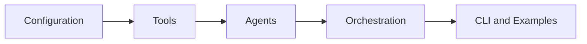

# Architecture

Agentic Internet is a Python package and CLI for autonomous internet research, browser automation, code execution, and multi-model orchestration.

## Diagram Standard

Architecture, flow, lifecycle, and dependency diagrams must be written in Mermaid.

## Layer Model

| Layer | Paths | Responsibility |
|-------|-------|----------------|
| Configuration | `agentic_internet/config/`, `.env.example` | Environment-derived settings and provider configuration |
| Tools | `agentic_internet/tools/` | Search, browser, MCP, and code execution capabilities |
| Agents | `agentic_internet/agents/` | Agent behaviors built from smolagents and project tools |
| Orchestration | `search_orchestrator.py`, `multi_model_serpapi.py`, `code_mode.py` | Multi-step routing, worker selection, and task coordination |
| Runtime surfaces | `agentic_internet/cli.py`, `agentic_internet/__main__.py`, `examples/` | Human-facing CLI and runnable examples |
| Verification | `tests/`, `test_*.py` | Behavioral and regression coverage |

## Dependency Direction

- Configuration is imported by tools, agents, and CLI surfaces.
- Tools do not import CLI modules.
- Agents compose tools; tools do not import agents.
- CLI modules call agents and configuration, but business behavior stays in package modules.
- Tests may import any public package surface.

## Golden Principles

GP-1: Secrets never enter source control. Use environment variables and `.env.example` placeholders only.

GP-2: Configuration is explicit at the boundary. Runtime defaults belong in `settings.py`, not scattered through agents.

GP-3: Tools are isolated capability adapters. Browser, web search, MCP, and code execution code should stay behind clear tool APIs.

GP-4: Agents orchestrate behavior; they should not hide network, filesystem, or execution side effects.

GP-5: Tests pin behavior before broad refactors. Add or update tests when changing agent routing, tool contracts, or CLI flags.

GP-6: Architecture changes move with documentation. Update this document, design docs, or exec-plans alongside structural changes.

## Technology Preferences

- Python 3.11+.
- `uv` for dependency and command execution.
- `pytest` and `pytest-asyncio` for tests.
- `ruff` for linting and formatting checks.
- `mypy` for static analysis where useful.
- `pydantic` for structured settings and validated data boundaries.

## Current Domains

- Internet research: search, scrape, news, synthesis.
- Browser automation: Browser Use Cloud SDK integrations.
- Code execution: constrained Python execution and data analysis helpers.
- MCP integration: MCP server/client examples and tool bridging.
- Multi-model orchestration: model selection, specialized workers, and search engine comparison.
