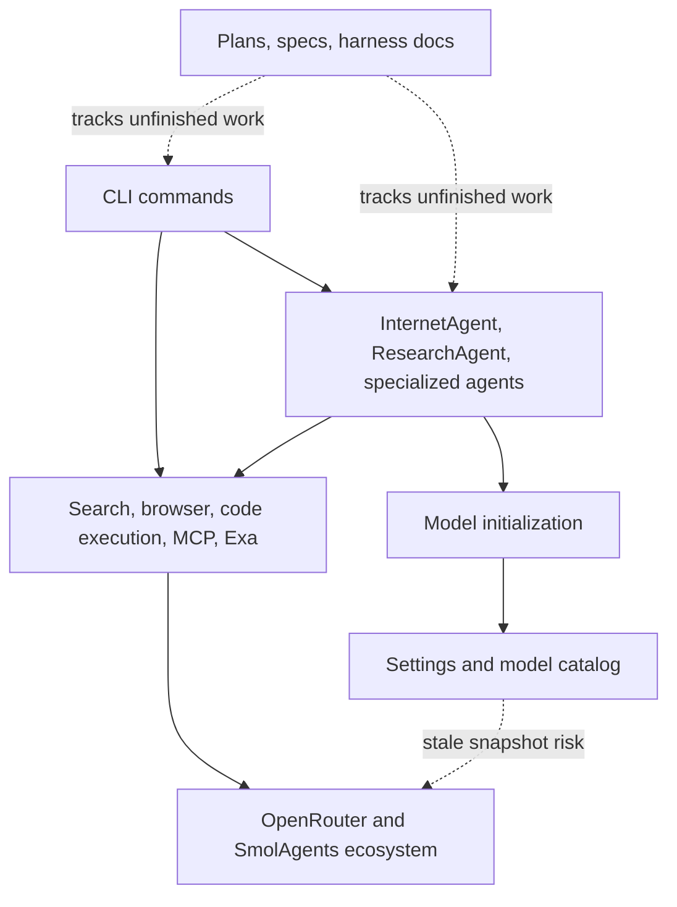

# Codebase Status

Status date: 2026-05-31

This map captures the current repository state, recent committed updates, unfinished local work, and external ecosystem changes that should drive the next implementation pass.

## Evidence Sources

- Local repository: `git log`, `git status`, `git diff`, `docs/plans/`, `docs/exec-plans/`, `agentic_internet/config/settings.py`, `agentic_internet/utils/model_utils.py`.
- OpenRouter: [List all models and their properties](https://openrouter.ai/docs/api/api-reference/models/get-models) and [`/api/v1/models`](https://openrouter.ai/api/v1/models), checked 2026-05-31.
- SmolAgents: [Guided tour](https://huggingface.co/docs/smolagents/guided_tour), [Tools tutorial](https://huggingface.co/docs/smolagents/tutorials/tools), [GitHub releases](https://github.com/huggingface/smolagents/releases), and Context7 `/huggingface/smolagents`, checked 2026-05-31.

## Current Shape

## Recent Committed Updates

| Commit | Area | What Changed | Follow-up |
|--------|------|--------------|-----------|
| `3ed2908` | Docs | Required Mermaid for architecture, flow, lifecycle, and system diagrams | Keep all future diagrams in Mermaid |
| `0e8ea39` | Harness | Added AGENTS map, docs knowledge base, `.opencode`, CI skeleton, golden-principles check | Finish first real feature exec-plan |
| `45d205a` | Search | Merged Exa search support | Verify Exa docs, tests, and env docs are complete |
| `a4c1a7c` | Search | Added Exa AI-powered search tool | Ensure `EXA_API_KEY` is represented in `.env.example` if runtime uses it |
| `49cfcac` | Specs | Added codebase specs | Migrate durable architecture flow into Mermaid docs where still useful |
| `5e8f43f` | Research output | Avoided duplicate research output | Add regression coverage if missing |
| `819a7ef` | MCP | Normalized MCP HTTP URLs without endpoints | Keep aligned with SmolAgents streamable HTTP guidance |
| `b617ea2` | MCP | Added MCP feature with SmolAgents | Recheck against current `MCPClient` structured-output support |
| `c9f5ec9` | Models | Updated/fixed model selection | Now stale against May 2026 OpenRouter inventory |

## Unfinished Work

| Work | Evidence | Status | Next Action |
|------|----------|--------|-------------|
| Code Mode MCP agent | Uncommitted files: `agentic_internet/agents/code_mode.py`, `agentic_internet/cli.py`, `agentic_internet/__init__.py`, `agentic_internet/agents/__init__.py`; plan: `docs/plans/2026-02-23-feat-code-mode-mcp-agent-plan.md` | Partially implemented, not committed | Add tests, verify against current SmolAgents APIs, then move plan into `docs/exec-plans/active/` |
| Code Mode acceptance criteria | Plan has unchecked functional and non-functional criteria | Not verified | Create focused tests for `ToolFacade`, `SearchTool`, `ExecuteTool`, exports, and `mcp run --agent-type code` |
| Model catalog freshness | `settings.py` says "updated Feb 2026"; OpenRouter has newer May 2026 models | Stale | Replace static-only catalog with refreshable OpenRouter snapshot or dynamic model listing |
| Initial harness setup | `docs/exec-plans/active/2026-05-30-initial-setup.md` remains `in_progress` | Incomplete | Close once first real feature exec-plan exists and local gates are runnable |
| Local quality gates | Current shell lacks `uv`, `pytest`, `ruff`, `mypy`, and `bd` on PATH | Blocked locally | Install/restore tooling path before final verification of code changes |
| Legacy plan location | `docs/plans/` exists beside `docs/exec-plans/` | Needs migration | Move active plans to `docs/exec-plans/active/`, completed plans to `docs/exec-plans/completed/` |

## External Findings

### OpenRouter

OpenRouter's model endpoint reports 354 models as of 2026-05-31. The newest agent-relevant models include:

- `stepfun/step-3.7-flash`
- `anthropic/claude-opus-4.8` and `anthropic/claude-opus-4.8-fast`
- `qwen/qwen3.7-max`
- `x-ai/grok-build-0.1`
- `google/gemini-3.5-flash`
- `google/gemini-3.1-flash-lite`
- `openai/gpt-chat-latest`

The repository currently stores OpenRouter models as LiteLLM-style IDs prefixed with `openrouter/`. OpenRouter's API returns provider IDs without that prefix, and `agentic_internet/utils/model_utils.py` adds `openrouter/` when needed. Keep that distinction explicit in any generated catalog.

See [OpenRouter model snapshot](references/openrouter-models-2026-05-31.md).

### SmolAgents

Current SmolAgents docs and releases emphasize:

- `CodeAgent` for expressive Python-based tool composition.
- `ToolCallingAgent` for predictable JSON tool calls.
- `MCPClient` and `ToolCollection.from_mcp()` for stdio and streamable HTTP MCP servers.
- `structured_output=True` for MCP tool output schemas and structured content.
- Stronger executor security guidance: local execution is not a security boundary; prefer remote/sandbox executors for untrusted code.
- Recent releases include Exa as a `WebSearchTool` engine, executor hardening, final-answer checks, GPT-5.2 support adjustments, and model parameter handling improvements.

See [SmolAgents feature snapshot](references/smolagents-features-2026-05-31.md).

## Recommended Next Pass

1. Stabilize and test the uncommitted Code Mode MCP work before touching model routing.
2. Update model catalog behavior to query OpenRouter dynamically, with a cached fallback generated from `/api/v1/models`.
3. Add a `models refresh` or `models sync-openrouter` command only after tests exist for provider ID normalization.
4. Update `.env.example` and docs for `EXA_API_KEY` if Exa is intended to be user-facing.
5. Restore local tooling availability (`uv`, `bd`, `ruff`, `mypy`, `pytest`) so code changes can be verified before push.
