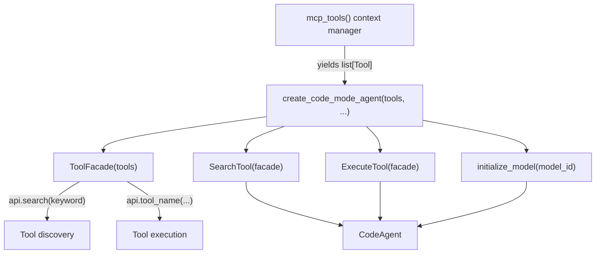

# feat: Add Code Mode Agent with Tool Facade for MCP

## Overview

Introduce `create_code_mode_agent()` — a factory function that builds a
`smolagents.CodeAgent` where every tool (MCP-sourced + codebase defaults) is
accessible through a single `ToolFacade` object bound to the name `api`.

The agent discovers tools via `api.search(query)` and executes multi-step
Python code against them via `api.<tool_name>(...)`, enabling loops,
conditionals, and data pipelines in a single reasoning step — a capability
`ToolCallingAgent` cannot provide.

The CLI `mcp run` command gains an `--agent-type` flag so users can activate
this mode without writing Python.

---

## Problem Statement

The current `mcp run` CLI path (`cli.py:718`) always creates a
`ToolCallingAgent` via `InternetAgent`. This has two limits:

1. **Sequential, one-at-a-time tool calls** — no loops or data pipelines.
2. **Tool list explosion** — large MCP servers expose dozens of tools; passing
   them all as individual smolagents `Tool` objects overwhelms the LLM's
   context and causes poor tool selection.

The submitted prototype solves both by collapsing all tools behind one `api`
facade and having a `CodeAgent` write Python to drive them.

---

## Proposed Solution

### New file: `agentic_internet/agents/code_mode.py`

Three components:

| Component | Role |
|-----------|------|
| `ToolFacade` | Dict-backed object; `api.tool_name(...)` → calls the tool; `api.search(q)` → keyword discovery |
| `SearchTool` | smolagents `Tool` that delegates to `facade.search()` |
| `ExecuteTool` | smolagents `Tool` that runs caller-provided Python in a `PythonExecutor` with `api` in scope |
| `create_code_mode_agent()` | Factory that wires facade + meta-tools + model → `CodeAgent` |

### CLI change: `agentic_internet/cli.py` (~line 719)

Add `--agent-type` option (values: `tool_calling` | `code`, default:
`tool_calling`) to `mcp run`. When `code` is selected, replace the
`InternetAgent(...)` construction with `create_code_mode_agent(tools=list(tools), ...)`.

### Export changes

- `agentic_internet/agents/__init__.py` — add `create_code_mode_agent`
- `agentic_internet/__init__.py` — add `create_code_mode_agent`

---

## Technical Approach

### Architecture



### `ToolFacade` design

```python
# agents/code_mode.py  (pseudocode — not implementation)

class ToolFacade:
    def __init__(self, tools: list[Tool]):
        self._tools = {t.name: t for t in tools}

    def search(self, query: str) -> str:
        # case-insensitive substring match on name + description
        # returns "api.tool_name(param: type)  # description[:120]" lines

    def __getattr__(self, name: str):
        if name in self._tools:
            return self._tools[name]   # callable Tool object
        raise AttributeError(
            f"Tool '{name}' not found. "
            f"Use api.search('{name}') to discover available tools."
        )
```

### `SearchTool` and `ExecuteTool` — serialization safety

Both tools hold a reference to `ToolFacade`, which is a live in-memory object
that cannot be pickled/serialized for E2B. Follow the prototype pattern:
override `to_dict()` to temporarily pop `self.facade` before calling
`super().to_dict()` and restore it in a `finally` block.

```python
# agents/code_mode.py  (pseudocode)

class SearchTool(Tool):
    name = "search"
    # ...
    def to_dict(self):
        facade_backup = self.__dict__.pop("facade", None)
        try:
            return super().to_dict()
        finally:
            if facade_backup is not None:
                self.facade = facade_backup
```

Apply the same pattern to `ExecuteTool`.

### `ExecuteTool` — executor choice

`ExecuteTool.forward()` instantiates `smolagents.LocalPythonExecutor` directly.
This is separate from the
codebase's existing `PythonExecutorTool` (`tools/code_execution.py:162`) which
is an AST-validated sandbox.

Default authorized imports for `ExecuteTool`:

```python
DEFAULT_EXECUTE_IMPORTS = ["json", "datetime", "re", "math", "os"]
```

### `create_code_mode_agent()` factory signature

```python
# agents/code_mode.py  (pseudocode)

def create_code_mode_agent(
    tools: list[Tool],
    model_id: str | None = None,           # falls back to settings.model.name
    verbosity_level: int = 2,
    max_steps: int = 25,
    executor_type: str = "local",          # "local" | "e2b"
    additional_authorized_imports: list[str] | None = None,
    **kwargs,
) -> CodeAgent:
    ...
```

Model initialization must reuse `initialize_model()` from
`agentic_internet/utils/model_utils.py:60` — do not duplicate the
provider-resolution logic.

### Default tools injection

The factory receives whatever `list[Tool]` the caller passes. To fulfil the
"MCP + default tools combined" decision, call `_get_default_tools()` from
`InternetAgent` as a standalone helper, or replicate the settings-gated
assembly inline. The simplest approach: accept the caller-provided `tools` list
as-is and document that callers who want default tools should pass them
explicitly. This keeps the factory pure and avoids coupling it to
`InternetAgent` internals.

> **Note:** This is a slight adjustment from the brainstorm — it keeps the
> factory self-contained. The `mcp run --agent-type code` CLI path can
> optionally merge default tools before calling the factory.

### CLI `mcp run` change

```python
# cli.py  (pseudocode delta)

agent_type: str = typer.Option(
    "tool_calling",
    "--agent-type", "-a",
    help="Agent type: 'tool_calling' (default) or 'code' (facade mode)"
)

# inside the with mcp_tools(...) as tools: block:
if agent_type == "code":
    from .agents.code_mode import create_code_mode_agent
    agent_obj = create_code_mode_agent(
        tools=list(tools),
        model_id=model,
        verbosity_level=2 if verbose else 0,
    )
    result = agent_obj.run(task)
else:
    agent_obj = InternetAgent(
        model_id=model,
        tools=list(tools),
        verbose=verbose,
    )
    result = agent_obj.run(task)
```

---

## Acceptance Criteria

### Functional

- [x] `create_code_mode_agent(tools, model_id)` returns a `smolagents.CodeAgent`
- [x] `ToolFacade.search("web")` returns formatted tool signatures for all tools
      whose name or description contains "web" (case-insensitive)
- [x] `ToolFacade.__getattr__("nonexistent")` raises `AttributeError` with a
      helpful message suggesting `api.search()`
- [x] `ExecuteTool.forward(code)` executes Python with `api` in scope and
      returns the result or an error string
- [x] `SearchTool.to_dict()` and `ExecuteTool.to_dict()` complete without error
      and restore `self.facade` after the call
- [x] `create_code_mode_agent()` falls back to `executor_type="local"` when
      `E2B_API_KEY` is not set and logs a warning
- [x] `agentic-internet mcp run "task" --server ./s.py --trust` still works
      (no regression — `--agent-type` defaults to `tool_calling`)
- [x] `agentic-internet mcp run "task" --server ./s.py --trust --agent-type code`
      uses `create_code_mode_agent` and prints the result
- [x] `from agentic_internet import create_code_mode_agent` works

### Non-Functional

- [x] No changes to `InternetAgent`, `ResearchAgent`, or any specialized agent
- [x] `code_mode.py` has no circular imports (only imports from `utils/`,
      `config/`, `exceptions`, and `smolagents`)
- [x] `additional_authorized_imports` parameter is additive on top of
      `DEFAULT_EXECUTE_IMPORTS`

---

## Implementation Phases

### Phase 1 — Core module (`agents/code_mode.py`)

**Tasks:**
1. Create `agentic_internet/agents/code_mode.py`
2. Implement `ToolFacade` class with `search()` and `__getattr__()`
3. Implement `SearchTool(Tool)` with `to_dict()` serialization guard
4. Implement `ExecuteTool(Tool)` with `to_dict()` serialization guard
5. Implement `create_code_mode_agent()` factory using `initialize_model()`
6. Add E2B fallback logic with `os.environ.get("E2B_API_KEY")` check and warning

**Files:**
- `agentic_internet/agents/code_mode.py` ← **new**

**Verify:** Import the module in a Python REPL; instantiate `ToolFacade` with
two `DuckDuckGoSearchTool` and `VisitWebpageTool` instances; call `facade.search("web")`.

---

### Phase 2 — Exports

**Tasks:**
1. In `agentic_internet/agents/__init__.py`: add import and `__all__` entry for
   `create_code_mode_agent`
2. In `agentic_internet/__init__.py`: add import and `__all__` entry for
   `create_code_mode_agent`

**Files:**
- `agentic_internet/agents/__init__.py`
- `agentic_internet/__init__.py`

**Verify:** `python -c "from agentic_internet import create_code_mode_agent; print(create_code_mode_agent)"` exits 0.

---

### Phase 3 — CLI integration

**Tasks:**
1. Add `--agent-type` / `-a` typer option to `mcp_run()` (`cli.py:719`)
2. Add conditional branch inside `with mcp_tools(...) as tools:` block:
   - `agent_type == "code"` → `create_code_mode_agent(...)`
   - else → existing `InternetAgent(...)` path (unchanged)
3. Update the info panel to display the agent type in use

**Files:**
- `agentic_internet/cli.py` (lines ~719–800)

**Verify:** `uv run python -m agentic_internet.cli mcp run --help` shows
`--agent-type` option. Existing `mcp run` invocations without the flag behave
identically to before.

---

## Dependencies & Risks

| Item | Detail |
|------|--------|
| `smolagents.LocalPythonExecutor` | Used directly in `ExecuteTool`; confirmed against the installed SmolAgents API. |
| E2B serialization | The `to_dict()` workaround is brittle — if smolagents changes its serialization mechanism this breaks silently. Acceptable for now; documented as a known limitation. |
| `ToolFacade.__getattr__` naming clash | If a tool is named `search` or `execute`, it will shadow the meta-tools in the facade. Guard: raise a clear error if tool names collide with reserved names. |
| MCP connection lifetime | `mcp_tools()` context manager must stay open during `agent.run()`. The CLI already handles this correctly — the `with` block wraps the entire agent execution. No change needed. |
| `CodeAgent` + `add_base_tools=False` | The factory defaults to no base tools to avoid optional dependency surprises; callers can override via `add_base_tools=True`. |

---

## Files Changed

| File | Change | Lines affected |
|------|--------|----------------|
| `agentic_internet/agents/code_mode.py` | **New** | ~330 lines |
| `agentic_internet/agents/__init__.py` | Add import + `__all__` entry | +2 lines |
| `agentic_internet/__init__.py` | Add import + `__all__` entry | +2 lines |
| `agentic_internet/cli.py` | Add `--agent-type` option + branch | ~+25 lines |
| `tests/test_cli_mcp.py` | CLI smoke coverage for Code Mode MCP routing with structured output | +79 lines |

**Total diff:** Core implementation plus CLI, model catalog, MCP structured-output, docs, and tests.

---

## Edge Cases (from SpecFlow analysis)

- **Empty tools list**: `create_code_mode_agent(tools=[])` — `ToolFacade` is
  empty; `api.search("anything")` returns "No matching tools found." Agent can
  still run with only the meta-tools. Callers can opt into base tools with
  `add_base_tools=True`.
- **Tool name with spaces or hyphens**: MCP tool names may contain `-` (e.g.,
  `get-weather`). `__getattr__` cannot be called with such names. Document:
  use `getattr(api, "get-weather")` or `api._tools["get-weather"](...)` as
  the escape hatch. `ToolFacade.search()` output should show both the raw name
  and the `api._tools["name"]` access pattern for non-identifier names.
- **Tool raises an exception**: `ExecuteTool` must catch all exceptions from
  tool calls and return them as `"Execution error: ..."` strings, not
  propagate them — otherwise the CodeAgent's reasoning loop crashes.
- **`model_id=None`**: Falls through to `initialize_model(None)` →
  `settings.model.name` → provider auto-detection. Same path as `InternetAgent`.
- **E2B key present but E2B package not installed**: `executor_type="e2b"` will
  raise at `CodeAgent` construction time. Wrap in a try/except with a clear
  message: "E2B package not installed. Run `pip install e2b-code-interpreter`."

---

## References

### Internal
- Prototype code provided in feature description (source of `ToolFacade`, `SearchTool`, `ExecuteTool` implementations)
- `agentic_internet/agents/internet_agent.py:90` — `_create_agent()` for CodeAgent construction pattern
- `agentic_internet/agents/internet_agent.py:112` — `_get_default_tools()` for tool assembly pattern
- `agentic_internet/utils/model_utils.py:60` — `initialize_model()` to reuse
- `agentic_internet/cli.py:718` — `mcp_run()` for CLI extension point
- `agentic_internet/agents/__init__.py:14` — `__all__` export pattern
- `agentic_internet/__init__.py:56` — top-level `__all__` export pattern with optional-import guard

### Brainstorm
- `docs/brainstorms/2026-02-23-code-mode-mcp-agent-brainstorm.md`
