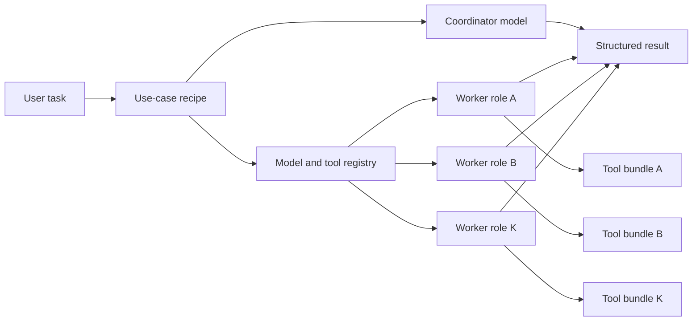

# Plan: K-LLM Use-Case Recipes

## Intent

Generalize the current multi-model orchestration path from one hardcoded
SerpAPI-centered workflow into configurable use-case recipes. A recipe should
define a task family, K model roles, tool bundles, routing policy, runtime
limits, and output expectations so different use cases can reuse the same
orchestration engine without editing `multi_model_serpapi.py`.

The first implementation should preserve the current research/search behavior
while introducing at least one different use case to prove the abstraction is
not search-only.

## Working Definition

K-LLM plus tools means:

- K is the number of worker roles participating in a use case.
- Each role can bind to a model preference, agent mode, prompt contract, and
  allowed tools.
- A coordinator can call worker agents as tools and may also use direct tools.
- A use case owns routing and output rules, not provider-specific code.



## Acceptance Criteria

- [x] A typed recipe model exists for use-case id, description, coordinator,
      worker roles, tool bundle names, routing policy, max steps, timeout, and
      output contract.
- [x] Existing research/search orchestration can be expressed as a recipe
      without changing its public CLI behavior.
- [x] At least one non-search-only use case is implemented as a recipe, such as
      market intelligence, technical due diligence, content creation, or code
      analysis.
- [x] CLI supports selecting a use case and passing worker/model overrides
      without hardcoding worker names in command logic.
- [x] Tests cover recipe validation, worker construction from recipes, CLI
      routing, and fallback behavior when a requested tool bundle or model is
      unavailable.
- [x] Architecture docs explain the recipe lifecycle with Mermaid diagrams.
- [x] Existing quality gates continue to pass.

## Non-Goals

- Do not add new provider dependencies in the first pass.
- Do not require live OpenRouter, SerpAPI, Browser Use, or MCP credentials for
  unit tests.
- Do not rewrite all of `multi_model_serpapi.py` at once.
- Do not implement persistent memory, billing, scheduling, or UI surfaces.
- Do not guarantee model availability beyond the existing provider settings and
  fallback behavior.

## Implementation Notes

Expected source shape:

- Add `agentic_internet/agents/use_cases.py` for typed recipe definitions and
  built-in recipe catalog.
- Add `agentic_internet/agents/orchestration_runtime.py` or a similarly scoped
  module to build workers from a recipe.
- Keep provider model construction behind `ModelManager` or a small registry
  adapter so recipes do not instantiate provider clients directly.
- Keep tool bundle resolution behind a registry that returns existing tool
  instances by capability name.
- Adapt `MultiModelSerpAPISystem` incrementally so its hardcoded workers become
  the built-in `research` recipe.
- Update `agentic_internet/cli.py` to accept a use-case selector for the
  existing `multi` command.

Suggested initial built-in recipes:

| Use Case | Coordinator | Workers | Tool Bundles | Purpose |
|----------|-------------|---------|--------------|---------|
| `research` | planner/reasoner | search, academic, local, commerce | web, scholar, maps, shopping | Preserve current behavior |
| `technical_due_diligence` | planner/reasoner | code, web, synthesis | web, code_execution, scraper | Analyze a technical target |
| `market_intelligence` | planner/reasoner | search, commerce, local, synthesis | web, shopping, maps | Evaluate market/business questions |

CLI sketch:

```bash
agentic-internet multi "Analyze this product category" --use-case market_intelligence
agentic-internet multi "Assess this repo idea" --use-case technical_due_diligence --workers qwen-coder --workers sonar
```

## Task Graph

| ID | Task | Depends On | Status |
|----|------|------------|--------|
| KLLM-1 | Define recipe data model and built-in catalog | none | complete |
| KLLM-2 | Add tool bundle registry over existing tools | KLLM-1 | complete |
| KLLM-3 | Add worker builder from recipe roles | KLLM-1, KLLM-2 | complete |
| KLLM-4 | Re-express current research flow as a recipe | KLLM-3 | complete |
| KLLM-5 | Add one different use-case recipe | KLLM-3 | complete |
| KLLM-6 | Wire CLI use-case selection and overrides | KLLM-4, KLLM-5 | complete |
| KLLM-7 | Add focused unit and CLI tests | KLLM-1 through KLLM-6 | complete |
| KLLM-8 | Update architecture and README docs | KLLM-6 | complete |
| KLLM-9 | Run full quality gates | KLLM-7, KLLM-8 | complete |

## Open Questions

- Which non-search use case should be the first proof point:
  `technical_due_diligence`, `market_intelligence`, `content_creation`, or
  another target?
- Should recipes live only in code for now, or should the first pass also load
  recipes from JSON/YAML?
- Should K be explicit in the CLI, or derived from the selected recipe's worker
  roles?
- Should tool bundle absence fail fast, warn and continue, or downgrade to a
  reduced recipe?

## Verification

Run:

```bash
uv run ruff check agentic_internet tests
uv run ruff format --check agentic_internet tests
uv run mypy agentic_internet
uv run pytest
python3 .opencode/tools/golden_principles.py
```

Add targeted tests before implementation reaches the full gate:

- `tests/test_use_cases.py`
- `tests/test_orchestration_runtime.py`
- CLI tests around `multi --use-case`

## Progress Log

| Date | Update |
|------|--------|
| 2026-06-01 | Plan created for generalizing one hardcoded multi-model flow into K-LLM plus tool use-case recipes. |
| 2026-06-01 | Implemented recipe catalog, tool bundle resolver, recipe-based worker setup, CLI `--use-case`, tests, and docs. Full `make check` passes with 196 tests. |
