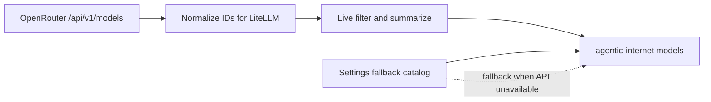

# OpenRouter Model Snapshot

Snapshot date: 2026-05-31

Sources:

- [OpenRouter models API reference](https://openrouter.ai/docs/api/api-reference/models/get-models)
- [OpenRouter `/api/v1/models`](https://openrouter.ai/api/v1/models)

The OpenRouter models endpoint returned 354 models during this pass. The API response includes model IDs, creation timestamps, names, context lengths, modalities, pricing, supported parameters, top-provider data, and expiration dates.

## Newest Models

| Created | API Model ID | Name | Context | Modality | Tools | Reasoning | Structured Outputs |
|---------|--------------|------|---------|----------|-------|-----------|--------------------|
| 2026-05-28 | `stepfun/step-3.7-flash` | StepFun: Step 3.7 Flash | 256000 | text+image+video->text | yes | yes | yes |
| 2026-05-27 | `anthropic/claude-opus-4.8-fast` | Anthropic: Claude Opus 4.8 Fast | 1000000 | text+image+file->text | yes | yes | yes |
| 2026-05-27 | `anthropic/claude-opus-4.8` | Anthropic: Claude Opus 4.8 | 1000000 | text+image+file->text | yes | yes | yes |
| 2026-05-21 | `qwen/qwen3.7-max` | Qwen: Qwen3.7 Max | 1000000 | text->text | yes | yes | yes |
| 2026-05-20 | `x-ai/grok-build-0.1` | xAI: Grok Build 0.1 | 256000 | text+image->text | yes | yes | yes |
| 2026-05-19 | `google/gemini-3.5-flash` | Google: Gemini 3.5 Flash | 1048576 | text+image+file+audio+video->text | yes | yes | yes |
| 2026-05-12 | `anthropic/claude-opus-4.7-fast` | Anthropic: Claude Opus 4.7 Fast | 1000000 | text+image+file->text | yes | yes | yes |
| 2026-05-12 | `perceptron/perceptron-mk1` | Perceptron: Perceptron Mk1 | 32768 | text+image+video->text | no | yes | yes |
| 2026-05-08 | `inclusionai/ring-2.6-1t` | inclusionAI: Ring-2.6-1T | 262144 | text->text | yes | yes | no |
| 2026-05-07 | `google/gemini-3.1-flash-lite` | Google: Gemini 3.1 Flash Lite | 1048576 | text+image+file+audio+video->text | yes | yes | yes |
| 2026-05-05 | `openai/gpt-chat-latest` | OpenAI: GPT Chat Latest | 400000 | text+image+file->text | yes | no | yes |
| 2026-04-30 | `x-ai/grok-4.3` | xAI: Grok 4.3 | 1000000 | text+image->text | yes | yes | yes |
| 2026-04-30 | `ibm-granite/granite-4.1-8b` | IBM: Granite 4.1 8B | 131072 | text->text | yes | no | yes |
| 2026-04-30 | `mistralai/mistral-medium-3-5` | Mistral: Mistral Medium 3.5 | 262144 | text+image+file->text | yes | yes | yes |
| 2026-04-28 | `openrouter/owl-alpha` | Owl Alpha | 1048756 | text->text | yes | no | yes |

## Agent-Relevant Pattern

The newest OpenRouter models are converging on:

- Long context windows near or above 1M tokens.
- Native tool calling support through the `tools` parameter.
- Structured outputs through `structured_outputs`.
- Explicit reasoning controls through `reasoning` or `include_reasoning`.
- Multimodal input for major frontier families.

## Repository Status

`agentic_internet/config/settings.py` now includes the newest agent-relevant
aliases from this snapshot, including Claude Opus 4.8, Qwen3.7 Max, Grok Build
0.1, Gemini 3.5 Flash, Step 3.7 Flash, and GPT Chat Latest.

`agentic_internet/utils/openrouter_models.py` adds a live fetch/normalization
helper, and `agentic-internet models --live` can list recent OpenRouter models
with tool, reasoning, and structured-output support.

## Implementation Guidance

- Store OpenRouter API IDs without the `openrouter/` prefix in snapshots.
- Add `openrouter/` only at the LiteLLM boundary, matching current `model_utils.py` behavior.
- Prefer dynamic list/search behavior over repeatedly editing a static catalog.
- Keep the checked-in fallback catalog current enough for offline behavior and tests.
