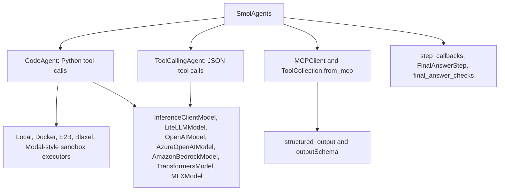

# SmolAgents Feature Snapshot

Snapshot date: 2026-05-31

Sources:

- [SmolAgents guided tour](https://huggingface.co/docs/smolagents/guided_tour)
- [SmolAgents tools tutorial](https://huggingface.co/docs/smolagents/tutorials/tools)
- [SmolAgents GitHub releases](https://github.com/huggingface/smolagents/releases)
- Context7 library ID: `/huggingface/smolagents`

## Current Feature Map

## Features Relevant to This Repository

| Feature | Current State | Repository Impact |
|---------|---------------|-------------------|
| `CodeAgent` | Expressive Python-based tool composition for multi-step tasks | Fits the in-progress Code Mode MCP facade |
| `ToolCallingAgent` | Structured JSON tool calls without arbitrary code execution | Keep as default for safer MCP runs |
| `MCPClient` | Supports stdio and streamable HTTP MCP servers | Current MCP integration should be checked against direct `MCPClient` usage |
| `structured_output=True` | Enables MCP output schemas, structured content, and JSON parsing | Add support when loading MCP tools so agents can reason over schemas |
| Tool output schemas | CodeAgent prompt can include output schema information | Useful for MCP tools with rich structured responses |
| Final answer checks | Agents can validate final answers and continue if invalid | Useful for CLI output contracts and JSON modes |
| `REMOVE_PARAMETER` | Lets model wrappers omit unsupported parameters | Useful for OpenRouter/xAI/OpenAI model compatibility differences |
| Executor security | Local executor is convenient but not a security boundary | Code Mode must document and test executor choices clearly |
| Exa in `WebSearchTool` | SmolAgents v1.26.0 adds Exa as a search engine option | Align repo Exa tool with upstream capability to avoid duplication |

## Recent Release Notes to Track

| Version | Date | Relevant Changes |
|---------|------|------------------|
| v1.26.0 | Current latest in release feed | Added Exa search engine option in `WebSearchTool`; removed remote WasmExecutor; LocalPythonExecutor doc updates |
| v1.25.0 | 2026-05-14 | Remote executor security hardening, serializer changes, loopback-only Wasm endpoint, Docker token handling, Hugging Face Hub >=1 support |
| v1.24.0 | 2026-01-16 | GPT-5.2 support adjustments, additional `apply_chat_template` params, tool-call coercion, `FinalAnswerStep` callbacks, robust Python timeout |
| v1.23.0 | 2025-11-17 | Blaxel support, custom Python executor support, rate-limit retries, Qwen3-Next default, MCP `anyOf` parsing, LocalPythonExecutor improvements |

## Code Mode Implications

The implemented `agentic_internet/agents/code_mode.py` has been validated
against the installed SmolAgents API in this repository:

- `ExecuteTool` executes through `LocalPythonExecutor`.
- `SearchTool.to_dict()` and `ExecuteTool.to_dict()` have regression coverage
  because recent SmolAgents releases changed serialization and executor behavior.
- MCP flows accept `structured_output=True` where SmolAgents supports it.
- `ToolCallingAgent` remains the default MCP path; Code Mode is explicit opt-in
  through `mcp run --agent-type code`.
- `tests/test_cli_mcp.py` covers the CLI routing path for
  `mcp run --agent-type code --structured-output` without requiring a live MCP
  server or model API key.
- Local execution remains trusted-user-only. For untrusted code, prefer sandbox
  executor configuration and clear CLI warnings.

## Recommended Upgrade Direction

1. Add a compatibility matrix for SmolAgents executor types used by this project.
2. Decide whether repo-specific Exa tooling should wrap upstream `WebSearchTool` Exa support or remain separate.
3. Add a small integration example for MCP streamable HTTP with structured output.
