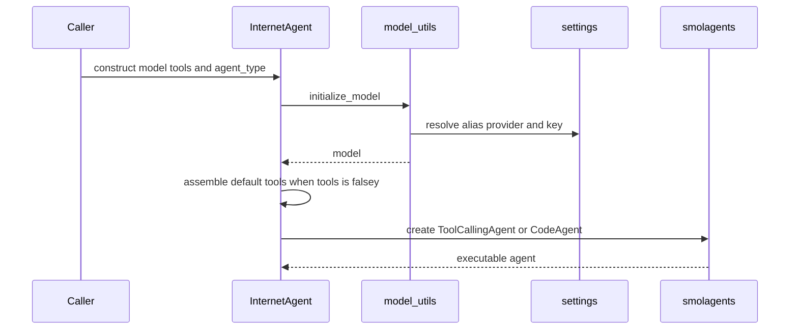

# Internet and Research Agents

`agentic_internet/agents/internet_agent.py` owns the default single-agent path. `InternetAgent` is the base public facade; `ResearchAgent` adds depth-specific prompts and in-memory history. CLI `chat`, `run`, `research`, and default `tools` all enter here.

## Construction



*Construction resolves the model before default tools and the underlying smolagents agent.*

`__init__` accepts `model_id`, `tools`, `verbose`, `max_iterations`, `planning_enabled`, `agent_type`, and extra authorized imports. Important invariants:

- `tools or self._get_default_tools()` means `tools=[]` cannot express a tool-free agent; supply a nonempty custom list or change this behavior deliberately.
- `_initialize_model` delegates to `initialize_model`; a falsey result raises `ModelInitializationError` during construction.
- `agent_type == "code"` creates `CodeAgent(max_steps=max_iterations)` with fixed authorized imports (`pandas`, `numpy`, JSON/CSV/regex/date/time, `requests`, `urllib`, math/statistics/collections) plus caller additions.
- Every other value creates `ToolCallingAgent`; unknown values are not rejected. The tool-calling branch does not pass `max_iterations`.
- `planning_enabled` is stored but does not alter agent creation or execution.

The broader isolation implications are compared in [System Architecture](../architecture/overview.md).

## Default tools

`_get_default_tools` uses the import-time `settings` singleton:

| Gate | Registered tools |
|---|---|
| `settings.tools.web_search_enabled` | `WebSearchTool`, `WebScraperTool`, `NewsSearchTool` |
| Above plus `settings.exa_api_key` | `ExaSearchTool`, `ExaFindSimilarTool` |
| `settings.tools.browser_enabled` plus `settings.browser_use_api_key` | sync, async, and structured Browser Use tools |
| `settings.tools.code_execution_enabled` | `PythonExecutorTool`, `DataAnalysisTool` |
| Best-effort always | `smolagents.load_tool("calculator")`; failure is debug-logged and ignored |

MCP tools are never defaults; the [MCP CLI path](../tools/mcp-integration.md) injects them explicitly. Tool contracts live under [Web Search](../tools/web-search-and-scraping.md), [Exa](../tools/exa-search.md), [Browser Automation](../tools/browser-automation.md), and [Code Execution](../tools/code-execution-and-data.md).

## Run and chat lifecycle

`run(task, show_result=True, **kwargs)` optionally renders the task, calls `self.agent.run(task, **kwargs)`, optionally renders returned Markdown, and returns `str(result)`. It catches every exception, logs the traceback, and returns `"Error executing task: ..."`. Callers must inspect outcomes; exception-to-string conversion often leaves CLI exit status zero.

`chat()` is a terminal loop. `exit`, `quit`, and `bye` stop; `help` and `tools` display local help; all other input calls `run`. A local `{user, agent}` history is appended but never returned or persisted. `KeyboardInterrupt` exits, while other loop errors are printed and the loop continues. `_show_tools` expects each tool to expose a string `description`.

## ResearchAgent

`ResearchAgent` delegates construction and initializes `research_history`. `research(topic, depth)` selects fixed `quick`, `moderate`, or `deep` prompts, calls `run(show_result=False)`, then appends and returns:

```text
{topic, depth, findings, timestamp}
```

The timestamp is `pandas.Timestamp.now().isoformat()`. An unknown depth uses the moderate prompt but preserves the unknown value in returned metadata; the CLI prevents this through its own validation. `get_research_history()` returns the mutable internal list, not a defensive copy.

## Extension and validation

Override `_initialize_model`, `_get_default_tools`, or `_create_agent` for controlled variants; prefer injecting a nonempty tool list for consumers. When adding a default tool, implement and export it under `agentic_internet.tools`, add the correct setting/key gate here, update any K-LLM inventory separately, and test both enabled and disabled registration.

Focused coverage is currently narrow: `tests/test_exa_search.py` proves conditional Exa registration. There is no isolated test for model failure, agent construction, `run`, chat, `ResearchAgent`, planning, or tool-calling iteration limits. Use `uv run pytest tests/test_exa_search.py` plus the focused suite for the tool/model code changed; run `uv run pytest` for constructor-wide changes.