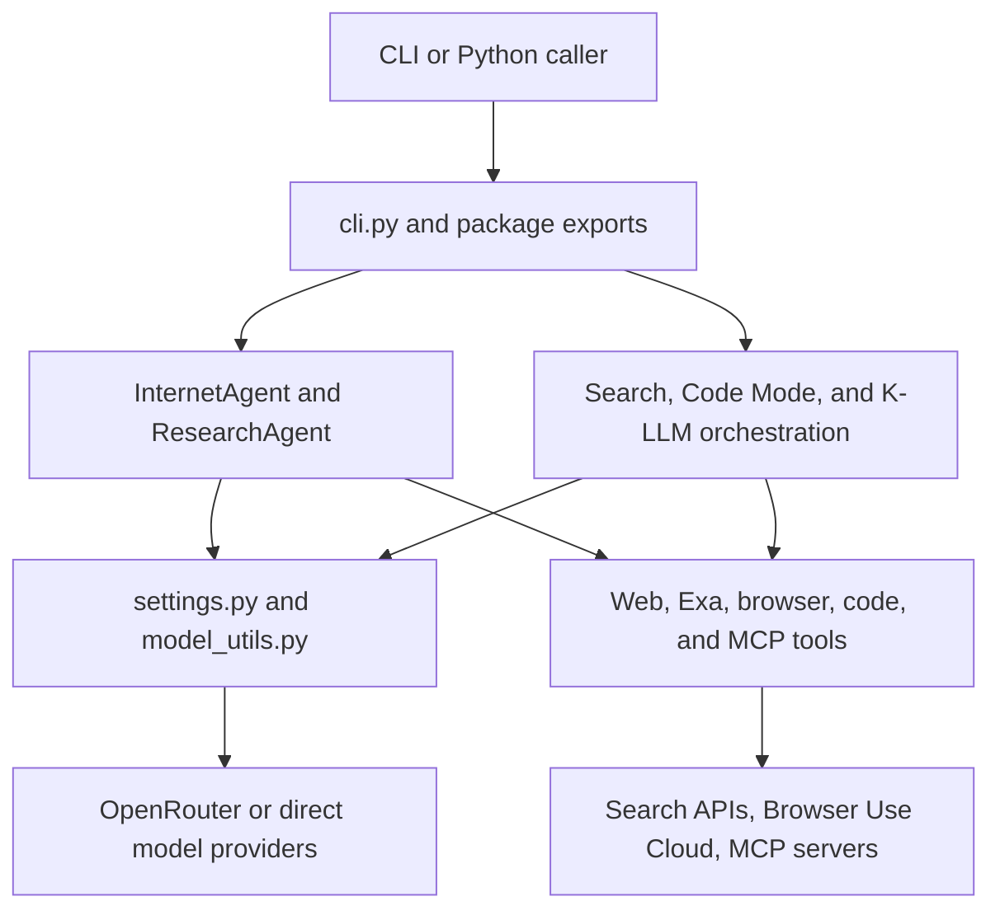

# System Architecture

Agentic Internet is one Python 3.11+ library and Typer CLI. It composes `smolagents` models and agents with local and hosted tools; it is not a web service and owns no database, queue, migration set, or durable application state. `pyproject.toml` installs `agentic-internet = agentic_internet.cli:app`; `agentic_internet/__main__.py` provides `python -m agentic_internet`. Root `main.py` is unrelated scaffold code.

## Layer and ownership map

*The public interfaces select an agent/orchestrator; agents own behavior, tools own side effects, and configuration resolves model/provider boundaries.*

| Layer | Owners | Rule |
|---|---|---|
| Interfaces | `cli.py`, root/subpackage `__init__.py` | Parse and route; library behavior remains in package modules. |
| Configuration | `config/settings.py`, `utils/model_utils.py`, `utils/openrouter_models.py` | Resolve aliases, providers, keys, and live model metadata. |
| Agents | `agents/internet_agent.py`, `basic_agent.py`, `specialized_agents.py` | Compose models and tools and normalize final results. |
| Orchestration | `search_orchestrator.py`, `code_mode.py`, `multi_model_serpapi.py`, recipes/runtime | Coordinate workers, tool facades, synthesis, and context. |
| Capabilities | `tools/` | Isolate external HTTP/SDK/MCP calls and local execution. |
| Verification | `tests/` | Focused mocked/unit behavior; root `test_*.py` scripts are excluded live checks. |

See [Settings and Models](../configuration/settings-and-models.md) for provider resolution, [Python API](../interfaces/python-api.md) for exports, and [CLI](../interfaces/cli.md) for all routes.

## Three orchestration paths

1. **Single agent:** `InternetAgent` resolves a model, assembles default or supplied tools, creates `ToolCallingAgent` or `CodeAgent`, then delegates `run`. `ResearchAgent` and the specialized agents are prompt/output facades over this path.
2. **Search orchestrator:** `SearchOrchestrator` runs named workers sequentially or in a thread pool, aggregates outcomes, and optionally invokes a synthesis `CodeAgent`. `WebSearchTool` can use it, then fall back to direct search.
3. **K-LLM:** `MultiModelSerpAPISystem` resolves a declarative recipe into tool bundles and worker agents, wraps workers as `AgentTool`s, and exposes them to a coordinator `CodeAgent`. Routing policy is prompt guidance, not a separate scheduler.

Code Mode is a fourth composition surface rather than an independent planner: it gives a `CodeAgent` only `search` and `execute` meta-tools, with real tools hidden behind `ToolFacade`.

## State and lifecycle

Runtime state is process-local:

- `ResearchAgent.research_history`, search-orchestrator history/counters, and K-LLM `ContextWindow`, `AgentMemory`, and `TaskContext` disappear with the process.
- Browser and MCP clients represent external connection lifecycles; MCP tools are valid only while their context manager remains open.
- `Settings.model_post_init` creates `~/.cache/agentic_internet`, but package code does not persist application records there.
- External providers own remote task/model/search state. API credentials enter through environment-derived settings or direct `os.getenv` calls.

## Canonical code-execution trust comparison

“Code execution” names materially different boundaries. None should be treated as safe for arbitrary untrusted input without a separately enforced sandbox.

| Path | Execution and imports | Side effects and limits | Fallback and evidence |
|---|---|---|---|
| `PythonExecutorTool` | Built-in `exec` after `_ASTSafetyValidator`; restricted builtins; preloads `numpy`, `pandas`, `requests`, `json`, math/time utilities. Blocks selected modules, calls, and dunder attributes. | Fresh bindings per call and 10,000-character final output, but no enforced timeout, CPU, memory, process, or network isolation. `requests` permits network access; traceback text is returned. | No remote executor. `tests/test_code_execution.py` checks major denylist cases and output behavior, not timeout, network, or exhaustion. See [Code Execution and Data](../tools/code-execution-and-data.md). |
| Code Mode `ExecuteTool` | Fresh smolagents `LocalPythonExecutor` per call with `api`, `json`, and `print`; default authorized imports include `os`, plus caller additions. The facade can invoke every wrapped local or MCP tool. | State does not persist between calls. Max print output is 15,000, but no repository-enforced resource timeout. `os` and facade tools amplify filesystem, network, and remote side effects. | Factory request for E2B silently falls back to local when `E2B_API_KEY` is absent. Tests cover facade execution and fallback construction, not isolation or live E2B. See [Code Mode](../orchestration/code-mode.md). |
| `InternetAgent(agent_type="code")` | smolagents `CodeAgent`; authorizes data/JSON/time/math plus `requests` and `urllib`, and caller additions. | `max_iterations` becomes `max_steps`, not a wall-clock/resource bound. Network-capable imports and registered tools remain side-effecting. | No remote executor selection here and no focused construction/security tests. See [Internet and Research Agents](../agents/internet-and-research.md). |
| K-LLM workers/coordinator | Code-capable recipe workers and the always-code coordinator use broad authorized imports and direct/worker tools. | Workflow has `asyncio.wait_for` around coordinator completion, but that is orchestration timeout, not executor resource isolation. SerpAPI, web, code, and worker tools may perform external effects. | Worker type depends on model heuristics; partial teams are allowed. No focused end-to-end coordinator or timeout tests. See [K-LLM Use Cases](../orchestration/k-llm-use-cases.md). |

MCP increases the boundary: discovered tools can run remote code or services, and Code Mode makes them callable from generated Python. Keep the MCP discovery context open, require explicit trust at the application boundary, and do not assume AST policy protects a separate CodeAgent or remote tool. See [MCP Integration](../tools/mcp-integration.md).

## External trust boundaries

- Web scraping follows redirects and validates only HTTP(S) syntax; private/link-local destinations and response size before parsing are not blocked.
- Browser tasks and task text leave the process for Browser Use Cloud.
- MCP stdio can execute an arbitrary configured command/path and receives the full parent environment; HTTP endpoints lack local host/scheme policy.
- `config --show` serializes settings containing API-key fields. Do not expose its output in logs.
- Most runtime failures become human-readable result strings, so a successful process exit does not guarantee a successful agent/provider operation.

## Change discipline

Preserve dependency direction: tools must not import CLI or agents; agents compose tools; interfaces route into agents. A public extension requires implementation, subpackage/root exports where intended, default registration or recipe inventory changes, consumer import documentation, and a focused test. Use the intent table in [Quickstart](../quickstart.md) and validation ownership in [Testing and Operations](../development/testing-and-operations.md).