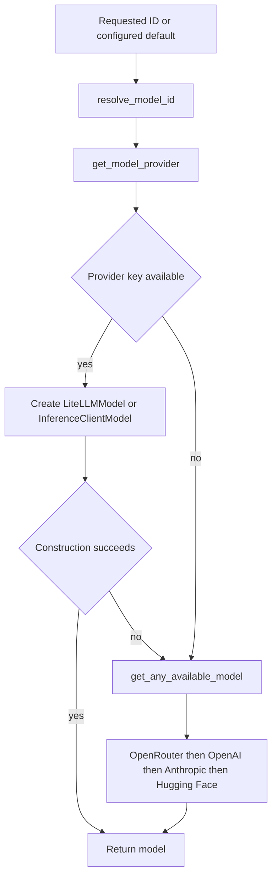

# Settings and Models

`agentic_internet/config/settings.py` defines configuration schemas and creates the import-time `settings = Settings()` singleton. `utils/model_utils.py` turns settings into smolagents model objects; `utils/openrouter_models.py` fetches a live public catalog for CLI display.

## Schemas and environment lifecycle

`ModelConfig` owns default model (`openrouter/anthropic/claude-opus-4.8`), provider `auto`, sampling/token settings, and OpenRouter/OpenAI/Anthropic/Hugging Face alias maps. `AgentConfig` owns verbosity, iteration, memory/tool-choice/planning values. `ToolConfig` owns web/code/browser/file flags and search-result count. `Settings` contains provider/tool keys, nested configs, cache path, and log level.

`load_dotenv()` runs on import. Explicit field factories bind `HUGGINGFACE_TOKEN`, `OPENAI_API_KEY`, `ANTHROPIC_API_KEY`, `OPENROUTER_API_KEY`, `BROWSER_USE_API_KEY`, and `EXA_API_KEY`. SerpAPI modules read `SERPAPI_API_KEY` directly; it is not a `Settings` field. Because `Settings` is `BaseModel`, not `BaseSettings`, `.env.example` names `ENVIRONMENT`, `LOG_LEVEL`, `MODEL_NAME`, `MODEL_TEMPERATURE`, and `MAX_TOKENS` do not configure fields. Nested model values require programmatic mutation/construction.

`model_post_init` creates `~/.cache/agentic_internet`. The singleton snapshots environment at import; later `os.environ` changes do not refresh it. `validate_startup` warns about every missing model-provider key, inserts a no-provider-key warning when all are absent, and warns about browser configuration, but not SerpAPI or Exa. It is a callable helper and is not automatically invoked by singleton construction or the CLI. `config --show` calls `settings.model_dump()` and renders the complete nested object without a redaction pass, including key-bearing fields; `--set` does not mutate anything. Never document or print real keys.

## Model resolution

*Unknown provider, missing key, or constructor failure enters the same provider-priority fallback.*

Alias lookup order is OpenRouter, OpenAI, Anthropic, then Hugging Face. Overlapping short aliases therefore prefer OpenRouter; use an unambiguous provider ID to select a direct API. Provider detection then follows this exact order: resolved IDs in the four explicit maps; an `openrouter/` marker; OpenAI name patterns; `claude`; known slash-prefixed providers routed to OpenRouter only when its key exists; Hugging Face organization patterns; and finally, only when configured provider is `auto`, a slash ID with OpenRouter key followed by available OpenAI, Anthropic, then Hugging Face credentials. A non-`auto` configured provider is the final answer when earlier checks do not match; otherwise provider is `None`.

`get_api_key_for_provider` selects `OPENROUTER_API_KEY`, `OPENAI_API_KEY`, `ANTHROPIC_API_KEY`, or `HUGGINGFACE_TOKEN`. `get_default_model_for_provider` reads these configured fallback IDs: OpenRouter `openrouter/anthropic/claude-opus-4.8`, OpenAI `gpt-5.2`, Anthropic `claude-opus-4.8`, and Hugging Face `meta-llama/llama-4-scout`. `list_available_models` reports each provider's configured model-map values only when that provider key exists; `get_model_info` reports requested ID, detected provider, key availability, and generation settings. `_create_model_for_provider` ensures one `openrouter/` prefix for OpenRouter `LiteLLMModel`, uses LiteLLM for OpenAI/Anthropic, and `InferenceClientModel` for Hugging Face. Unknown providers raise `ModelInitializationError` inside the factory; missing keys, unknown detection, and constructor exceptions cause `initialize_model` to try `get_any_available_model` in OpenRouter/OpenAI/Anthropic/Hugging Face order. If every attempt fails it returns `None`.

## Catalogs and drift

There are three independent hard-coded catalogs: `ModelConfig` aliases, CLI categorized models, and K-LLM `ModelManager` models/roles. The live OpenRouter helper filters provider models with tools/structured output/reasoning capabilities and sorts newest-first, falling back to CLI static data on fetch failure. K-LLM still uses Claude 4.5 for orchestration while central settings/static CLI default to 4.8. Documentation/examples contain more versions. Update each actual consumer deliberately; do not assume one catalog propagates.

`ModelManager` additionally requires `OPENROUTER_API_KEY`; it has no free Hugging Face fallback despite an example claim. See [K-LLM Use Cases](../orchestration/k-llm-use-cases.md).

## Change and validation

To add a provider end to end: add its credential field/environment binding; alias map and fallback model in `ModelConfig`; explicit-map and pattern/configured-provider detection in `get_model_provider`; key selection, available-model reporting, and model info; concrete smolagents construction in `_create_model_for_provider`; fallback priority in `get_any_available_model`; startup warning policy; and any static/live CLI plus K-LLM `ModelManager` inventory/role mappings that should expose it. Verify prefix/ID conventions and duplicate alias precedence. For an ordinary setting, add a real field factory or settings-source mechanism, sample placeholder, consumer gate, and reload-aware test.

Focused proof includes `tests/test_model_utils.py::TestInitializeModel::test_resolves_short_alias_before_creating_model`, `TestCreateModelForProvider::test_openrouter_adds_prefix`, `TestCreateModelForProvider::test_openrouter_no_double_prefix`, `TestInitializeModel::test_fallback_on_no_provider`, and `test_fallback_on_no_api_key`; startup warnings are pinned by `tests/test_settings.py::TestSettings::test_validate_startup_no_keys` and `test_validate_startup_with_key`. The settings/model/OpenRouter files also cover defaults, provider/key lookups, live filtering, and summaries. They do not cover inert sample variables, singleton refresh, cache creation, alias collisions, or catalog consistency.