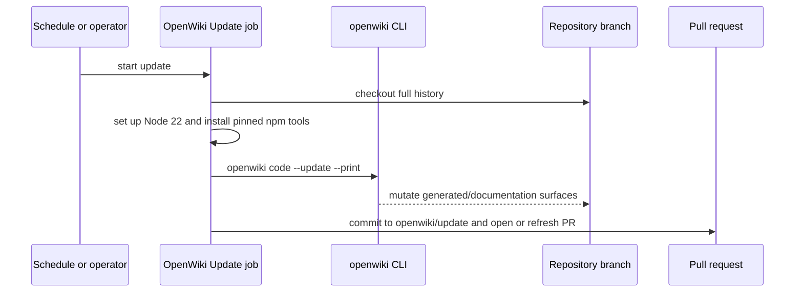

# Testing and Operations

The project uses Python 3.11+, `uv`, pytest, Ruff, mypy, and a repository harness. `pyproject.toml` defines runtime/dev dependencies and pytest scope; `Makefile` mirrors the expected local gates.

## Local commands

| Intent | Narrow command | Broader command |
|---|---|---|
| Unit behavior | `uv run pytest tests/<focused_file>.py` | `uv run pytest` |
| Lint | `uv run ruff check agentic_internet tests` | `make lint` |
| Format check | `uv run ruff format --check agentic_internet tests` | `make format` |
| Types | `uv run mypy agentic_internet` | `make typecheck` |
| Package | `uv build` | `make build` |
| Harness principles | `python3 .opencode/tools/golden_principles.py` | `make golden` |
| Full local gate | — | `make check` |

Pytest discovers only `tests/`. Root `test_agent.py` and `test_simple_agent.py` are credentialed live scripts outside normal collection despite their names. The declared `integration` marker should protect future external-service tests; focused tests currently rely heavily on mocks.

## Test ownership

| Area | Focused files |
|---|---|
| Settings/model catalogs | `test_settings.py`, `test_model_utils.py`, `test_openrouter_models.py` |
| Core/basic/specialized agents | `test_basic_agent.py`, `test_specialized_agents.py`; core Internet/Research coverage is sparse |
| Search/K-LLM | `test_search_orchestrator.py`, `test_use_cases.py`, `test_orchestration_runtime.py`, `test_context_engineering.py`, `test_cli_use_cases.py` |
| Code Mode/execution | `test_code_mode.py`, `test_code_execution.py`, `test_cli_mcp.py` |
| Web/Exa/browser | `test_web_search.py`, `test_exa_search.py`, `test_browser_use.py` |
| MCP | `test_mcp_integration.py`, `test_cli_mcp.py`; availability-dependent cases can skip |
| Errors | `test_exceptions.py` |

Tests establish behavior, not complete security guarantees. External lifecycle, resource isolation, SerpAPI/K-LLM end-to-end behavior, Browser async streams, and live MCP cleanup are notable gaps described on owning pages.

## Python CI workflow

`.github/workflows/ci.yml` runs on pushes and pull requests to `master`/`main`. Its Python 3.11 preflight performs `uv sync --all-extras --dev`, Ruff format/lint, mypy, pytest, golden-principles checks, then TruffleHog. Checkout/setup actions use moving major tags and TruffleHog uses `@main`, unlike the commit-SHA pinning in OpenWiki automation; dependency/action supply-chain policy is therefore inconsistent.

## OpenWiki update workflow

`.github/workflows/openwiki-update.yml` runs manually and daily at `0 8 * * *`. It grants `contents: write` and `pull-requests: write`, so changes to this workflow require security review.

*Full history lets OpenWiki diff against its last documented commit; allowed paths are staged into an automated PR rather than pushed directly to the default branch.*

Operational details:

- Checkout and Node setup are pinned to commit SHAs; `create-pull-request` is also SHA-pinned. Global npm packages are version-pinned: `openwiki@0.3.3`, `mermaid@11.16.0`, and `jsdom@29.1.1`, but installation still executes registry-delivered package code with job permissions.
- `fetch-depth: 0` is required because incremental update compares HEAD to the previously documented commit; shallow history would produce an empty/incorrect change summary.
- Runtime uses Baseten with `BASETEN_API_KEY` and model `moonshotai/Kimi-K3`. `OPENWIKI_LANGSMITH_API_KEY` authenticates connector pulls. Optional `LANGSMITH_API_KEY` plus `LANGCHAIN_PROJECT=openwiki` and tracing enabled sends run traces to LangSmith. Keep secrets scoped to this job and assume prompts/traces may contain repository content; never echo values.
- `openwiki code --update --print` can generate/update wiki content. The PR action stages only `openwiki`, `AGENTS.md`, `CLAUDE.md`, and `.github/workflows/openwiki-update.yml`; this mutation allowlist is broader than this documentation run’s manual write policy.
- The action writes branch `openwiki/update`, commit/title `docs: update OpenWiki`, and creates or refreshes an automated PR. Human review remains the merge boundary; inspect documentation claims and any instruction/workflow modifications closely.

## Examples and operational boundaries

`examples/basic_usage.py`, `advanced_usage.py`, `multi_model_example.py`, `orchestrated_search_example.py`, and MCP examples demonstrate consumers but are not hermetic checks. Most need real provider keys/network/local servers. `example_mcp_server.py` requires undeclared `fastmcp`; the multi-model example claims a free-model fallback that `ModelManager` does not implement. README snapshots also omit MCP and contain stale test count/Black guidance; source, tests, Makefile, and workflows are authoritative.

## Validation strategy

Start with the owning focused suite listed above. Add adjacent caller tests when changing an export, registration, recipe bundle, or CLI route. Use the full local gate before merging broad changes. External checks must be explicit `integration`, use placeholder/sample credentials only, avoid logging configuration, and clean up remote tasks/processes.