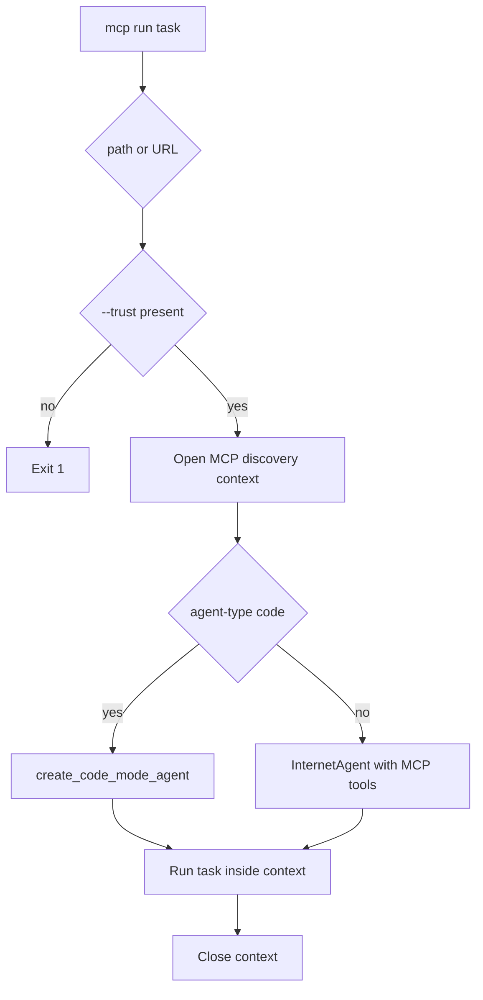

# Command-Line Interface

`agentic_internet/cli.py:app` is installed as `agentic-internet`; `python -m agentic_internet` and `python -m agentic_internet.cli` reach the same app. Root `main.py` does not. Most commands catch exceptions, print an error, and raise Typer exit 1, but underlying agents often return error strings without raising.

## Agent and research commands

| Command | Runtime route | Important behavior |
|---|---|---|
| `chat` | construct `InternetAgent` → `chat()` | Model, verbose, and max iterations are forwarded. Interactive built-ins are `help`, `tools`, and exit words. |
| `run TASK` | `InternetAgent(model_id=--model, verbose=--verbose/--quiet, max_iterations=--max-iterations)` → `InternetAgent.run(task)` | This route does not expose `agent_type`, so construction uses the `tool_calling` default. Optional `--output` calls `Path.write_text(str(result))` and prints a saved message. Without output, display comes from the agent; quiet mode can suppress useful result display. A raised constructor, filesystem, or uncaught CLI error is printed and exits 1. An execution exception caught by `InternetAgent.run` becomes an error-like string, can be written normally, and usually leaves exit 0. |
| `research TOPIC` | validate depth → `ResearchAgent.research` | Depth must be quick/moderate/deep. With output, exact `json` uses JSON; every other format writes hand-built Markdown. Format has no effect without output. |
| `config` | inspect global `settings` | `--show` serializes settings, including secret-bearing fields; do not log it. `--set` only reports unsupported runtime mutation. |
| `tools` | construct `InternetAgent` and inspect `agent.tools` | Default listing unnecessarily requires model initialization. `--multi` is a hard-coded SerpAPI list; `--use-cases` derives recipe data. |

Core construction and failure semantics are in [Internet and Research Agents](../agents/internet-and-research.md).

## Multi-model commands

`multi TASK` resolves `--use-case`, parses repeated `--worker-model worker=model`, constructs `MultiModelSerpAPISystem`, sets up recipe workers, then executes with `asyncio.run`. Only the first `--models` value becomes both default worker model and coordinator. `--news`, `--workers`, verbosity/quiet, and later model values are accepted but unused. Output JSON wraps workflow `results` that are themselves JSON text.

`orchestrate TASK` uses the default `research` recipe, coordinator option, and fixed 600-second timeout. Its worker list and verbosity options are display/accepted inputs only and do not configure workers. Default coordinator remains Claude 4.5.

`news QUERY` turns timeframe, source, and limit into prompt text, then invokes the same general workflow with 300 seconds. These constraints are not enforced provider parameters. JSON formatting is honored only when writing a JSON output file; otherwise result printing is generic.

See [K-LLM Use Cases](../orchestration/k-llm-use-cases.md) before changing these routes.

## Model and utility commands

`models` can show a static categorized catalog or, with `--live`, fetch/filter the public OpenRouter inventory and fall back to static data. Static categories include `general`, `code`, `research`, `news`, and `science`; help omits `science`, and unknown categories produce an empty table. `version` prints root `__version__`.

## MCP command group



*`mcp run` requires explicit trust and keeps remote tools alive through execution.*

- `mcp list` loads contiguous `MCP_SERVER_N_*` environment definitions and displays configuration.
- `mcp info` reports package/transports/environment conventions; it mentions `fastmcp`, which is not a declared dependency.
- `mcp run` first imports the MCP helpers and exits 1 with installation guidance when `is_mcp_available()` is false. It then requires path or URL and `--trust`. `--agent-type` is a plain string but is explicitly restricted to exactly `tool_calling` or `code`; any other value prints the received value and exits 1. The route forwards `structured_output`, then selects [Code Mode](../orchestration/code-mode.md) or tool-calling `InternetAgent`. When both path and URL are supplied, path wins.
- `mcp test` connects and lists tools but has no trust option; it unconditionally sets trust true.

Transport and environment risks are canonical in [MCP Integration](../tools/mcp-integration.md).

## Error and output discipline

Treat returned strings beginning with error language or workflow JSON `error` fields as failures even when exit status is zero. Output file writes are direct `Path.write_text` calls without atomic replacement. CLI model/tool listing may instantiate network-configured objects. Never paste `config --show` output into issues.

## Focused validation

`tests/test_cli_mcp.py` pins Code Mode, trust, structured-output, model, quiet verbosity, and task routing. `tests/test_cli_use_cases.py` pins use-case/default model/worker override/coordinator routing and recipe listing. Other commands and output files lack focused tests. For CLI changes run:

```bash
uv run pytest tests/test_cli_mcp.py tests/test_cli_use_cases.py
uv run python -m agentic_internet.cli --help
uv run python -m agentic_internet.cli mcp --help
```

Add `CliRunner` cases for every changed validation, routing, output, and exit-status branch.