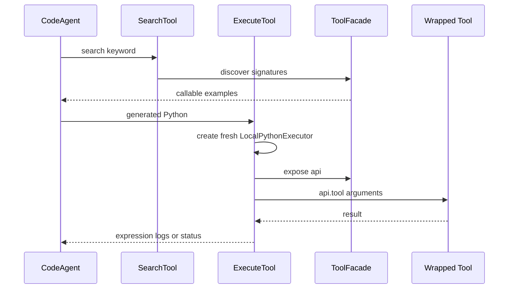

# Code Mode

`agentic_internet/agents/code_mode.py` prevents large tool catalogs from entering a `CodeAgent` prompt directly. `create_code_mode_agent` gives the agent two meta-tools—`search` and `execute`—while `ToolFacade` exposes the actual local or MCP tools as Python-callable `api` members.

## Facade contract

`ToolFacade(tools)` indexes tools by `tool.name`. Reserved names `search`, `execute`, and `_tools` are skipped; duplicate names are last-write-wins. `search(query)` performs case-insensitive substring matching over names/descriptions and emits signatures from each tool’s `inputs` schema:

- identifier name: `api.web_search(query: string)`
- nonidentifier name: `api._tools["get-weather"](city: string)`

Descriptions are truncated to 120 characters; no match is exactly `No matching tools found.` Attribute access returns the callable tool itself. Missing public attributes raise an `AttributeError` that directs the model to `api.search(...)`; private attributes retain normal failure semantics.

## Meta-tool execution

*Discovery describes wrapped tools; execution runs generated Python with the facade in a fresh local executor.*

`SearchTool.forward` delegates to the facade. Both meta-tools temporarily remove their nonserializable facade during `to_dict()` and restore it in `finally`, supporting E2B serialization.

`ExecuteTool` deduplicates default imports plus caller additions. Defaults include `json`, regex/date/time/math/statistics/collections, data libraries, HTTP utilities, and `os`. Every call creates a new `LocalPythonExecutor`, sets 15,000 maximum print output, and exposes `api`, `json`, and `print`. Return precedence is non-`None` last expression, stripped logs, then `Execution successful.`; exceptions become `Execution error: ...`. State does not persist between calls.

## Factory and executor selection

`create_code_mode_agent(tools, model_id, verbosity_level, max_steps, executor_type, additional_authorized_imports, **kwargs)` creates one facade and the two meta-tools, resolves the model, and raises `ModelInitializationError` if none is available. It defaults `add_base_tools=False` and attaches `agent.facade` dynamically.

For `executor_type="e2b"`, an available `E2B_API_KEY` enters executor kwargs. Without it, the factory warning-logs and **silently changes to local execution**. Unknown executor strings pass through to smolagents. Local execution authorizes `os` and can call every facade tool, so it can amplify filesystem, network, browser, and remote MCP effects; output bounds are not CPU/memory/wall-clock isolation. The canonical comparison is [System Architecture](../architecture/overview.md).

## MCP lifecycle

`mcp run --agent-type code` opens [MCP discovery](../tools/mcp-integration.md), materializes remote tools, creates this agent, and runs the task before leaving the context. Do not return and use the facade after context exit. Remote tool names colliding with reserved names are unavailable through the facade. `structured_output` affects MCP discovery, not `ExecuteTool` result typing.

## Extension and validation

A new wrapped tool needs a valid `name`, `description`, `inputs`, and callable behavior; nonidentifier names remain supported. Add imports only when generated code truly needs them and assess side effects. Preserve facade stripping in serialization changes.

`tests/test_code_mode.py` checks identifier/nonidentifier discovery, case-insensitive/no-match behavior, direct facade invocation, reserved names, serialization restoration, execution/error strings, CodeAgent creation, and no-key E2B fallback. `tests/test_cli_mcp.py` pins context and factory routing. No test covers live E2B, key forwarding, resource isolation, duplicate names, logs-only/status branches, or model failure. Run both focused files for MCP-facing changes.