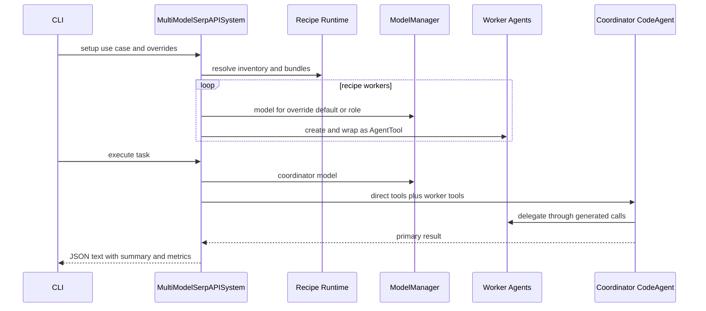

# K-LLM Use-Case Orchestration

`MultiModelSerpAPISystem` in `agents/multi_model_serpapi.py` is the largest runtime. It combines declarative recipes (`use_cases.py`), tool-bundle resolution (`orchestration_runtime.py`), model-specific workers, SerpAPI tools, and a coordinator `CodeAgent`. CLI `multi`, `orchestrate`, and `news` route here.

## Recipes and bundles

Frozen `WorkerRecipe` requires nonempty name/description/model role and carries ordered bundles, requested agent type, and `required`. Frozen `UseCaseRecipe` requires an ID, workers with unique names, `max_steps >= 1`, and positive timeout; `k` is worker count. `required` is declarative and not enforced.

Built-ins are:

| ID | Workers | Purpose |
|---|---|---|
| `research` | search, ecommerce, local-business, academic researchers | Broad multi-source research |
| `technical_due_diligence` | technical researcher, code analyst, risk synthesizer | Technical/code/risk review |
| `market_intelligence` | market, commerce, local-signal analysts | Market and location signals |

`get_use_case_recipe` strips/lowercases and maps hyphens to underscores. Unknown IDs raise `ValueError` listing available IDs. `list_use_case_recipes()` returns recipes sorted by registry key, while each recipe preserves declared worker order. `TOOL_BUNDLES` maps logical names such as `web`, `scraper`, `multi_engine`, `shopping`, `maps`, `scholar`, `code_execution`, and `browser` to tool names.

`resolve_tool_bundles` indexes concrete tools last-name-wins, walks requested bundles in order, adds every present expected tool with global name deduplication, and marks an unknown or wholly unavailable bundle missing. `resolve_use_case_tools` resolves recipe `direct_tool_bundles` separately, then each worker's bundles independently; worker misses become `worker_name:bundle`, and the final missing-label list is order-preserving/deduplicated. `summarize_use_case` exposes recipe ID/description, `k`, coordinator, policy, ordered worker definitions and resolved names, direct tool names, missing bundles, and output contract. Missing bundles warn but do not block workers. Current inventory contains direct web/news/scraper, Python/data tools, and optional SerpAPI tools—not Exa or Browser Use—so those declared names cannot currently resolve.

## Setup and execution

*The coordinator receives direct tools and successfully built worker wrappers; recipe policy guides its prompt rather than a separate scheduler.*

`setup_use_case_workers` clears previous workers, stores the active recipe/resolution, and selects each model by worker override, then default model, then recipe role. Unknown override names are ignored. Worker creation is soft-failure and permits partial teams. Requested `CodeAgent` is honored only when a model-ID heuristic says code-capable; otherwise a tool-capable model becomes `ToolCallingAgent`, and only models classified as neither become `BasicAgent`. Explicit recipe `BasicAgent` is not honored for tool-capable models.

`execute_multi_model_workflow` replaces `current_task_context` with a timestamped `TaskContext(objective=task, total_steps=10)`, then chooses the already-active recipe or looks up `use_case_id`. If no workers exist, it implicitly calls setup with `default_model=orchestrator_model`. A still-empty team returns compact JSON text `{"error": "No workers available. Please check API keys and configuration.", "task": task}` before the main try block. A missing coordinator model returns the distinct `{"error": "No orchestrator model available. Please check API keys.", "task": task}`.

The coordinator prompt includes recipe ID, description, routing policy, and output contract as instructions; the contract is not schema-validated. Coordinator tools are exactly resolved `direct_tools` (empty without active resolution) followed by every successfully wrapped `worker_tools` value. The coordinator is `CodeAgent(max_steps=recipe.max_steps)` with broad data, HTTP, and utility imports. Synchronous `run` executes in a thread under `asyncio.wait_for`; caller timeout overrides `recipe.timeout_seconds`.

Success returns indented JSON **text** with keys `primary_result`, `use_case`, `search_performance`, and `cross_engine_analysis`, then calls `update_context_from_result(..., success=True)` to append context/episodic memory. Timeout records failure and returns compact `{"error": "Multi-model workflow execution exceeded <supplied timeout> seconds", "task": task}`; because it interpolates the original argument rather than effective timeout, recipe-default timeout can report `None`. Any other exception records failure and returns `{"error": "Multi-model workflow execution failed: ...", "task": task}`. The two early missing-worker/model returns do not call `update_context_from_result`. Search performance is computed for successful output from whatever tool searches have already logged; the workflow itself does not advance TaskContext steps or independently add performance records.

`routing_policy`, including `parallel_then_synthesize`, is prompt content only. Workers are not programmatically run in parallel. See [CLI](../interfaces/cli.md) for options that are accepted but do not change this behavior.

## Model and SerpAPI ownership

`ModelManager` requires `OPENROUTER_API_KEY`, builds a hard-coded model suite with per-model soft failures, resolves direct aliases then role mappings, and falls back through Claude, DeepSeek, Gemini, and Mistral. Static capability metadata does not prove actual availability. These catalogs differ from central settings; see [Settings and Models](../configuration/settings-and-models.md).

The system’s five smolagents tools are `GoogleSearchTool`, `GoogleShoppingTool`, `GoogleMapsLocalTool`, `GoogleScholarTool`, and `MultiEngineSearchTool`. They require `SERPAPI_API_KEY`, normalize provider dictionaries to JSON strings, and catch failures into strings. Multi-engine search supports exact lowercase `google,bing,yahoo,baidu`, isolates per-engine errors, and compares exact links. Result Pydantic models (`SearchResult`, `LocalResult`, `ShoppingResult`, `NewsResult`, `ScholarResult`, `ImageResult`) are available in the module but are not instantiated to enforce tool output.

## Context engineering

`ContextWindow` estimates tokens as 1.3 times word count, inserts high-priority content first, and compresses only when more than five items exist. Compression preserves first/last two items with a marker and estimates 60% of capacity; small sets can exceed thresholds. `AgentMemory` tracks search attempts/successes/best parameters and bounded episodic records, but its average calculation is not a cumulative mean. `TaskContext` records search history and cross-engine results; workflow progress is initialized to ten steps but never advanced. Performance average logic and `common_results` are similarly incomplete. Treat metrics as diagnostics, not accounting-grade measurements.

## Adding a use case

1. Add a validated `UseCaseRecipe` to `BUILT_IN_USE_CASES`; keep worker names unique and output contract explicit. This automatically feeds sorted `list_use_case_recipes()` and therefore `tools --use-cases` recipe/worker metadata.
2. Add any new logical bundle to `TOOL_BUNDLES`. Implement/export the concrete tool, ensure `create_use_case_tool_inventory` constructs an object whose `name` exactly matches the bundle entry, and include the bundle in the recipe's direct or worker tuple. Without all three, resolution only reports a missing bundle and setup can silently produce an under-equipped worker.
3. Confirm model roles/overrides resolve in `ModelManager`; model precedence is per-worker override, CLI/default model, then `worker.model_role`. Decide whether requested agent type needs stricter runtime enforcement.
4. Update CLI flags/help only if the recipe needs new input beyond registry discovery, and test lookup, bundle resolution/missing behavior, setup arguments, summary, and execution policy.
5. If implementing a new routing policy, add a real execution branch rather than prompt wording alone.

Specific ownership: `tests/test_orchestration_runtime.py::test_parse_worker_model_overrides_rejects_bad_format`, `test_resolve_use_case_tools_reports_missing_worker_bundle`, and `test_summarize_use_case_includes_k_and_workers`; `tests/test_use_cases.py::test_recipe_rejects_duplicate_workers` and `test_list_use_case_recipes_is_stable`; and `tests/test_cli_use_cases.py::test_multi_command_routes_use_case_and_worker_overrides` plus the recipe-listing CLI test. `test_context_engineering.py` covers memory primitives. There are no mocked end-to-end tests for SerpAPI request normalization, `ModelManager`, worker type selection, partial teams, coordinator tools, timeout, or result serialization.