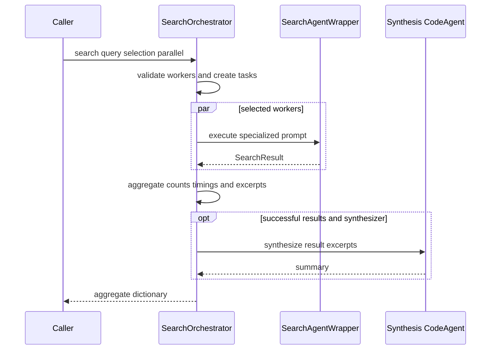

# Search Orchestrator

`agentic_internet/agents/search_orchestrator.py` is a model-agnostic worker coordinator distinct from K-LLM recipes. Public exports are `SearchOrchestrator` and `create_search_orchestrator`; module-level contracts also include `SearchTask`, `SearchResult`, and `SearchAgentWrapper`.

## Contracts and setup

`SearchTask` carries query, task ID, agent name, `search_type="general"`, and metadata. `SearchResult` records identity, arbitrary result, success, elapsed seconds, and optional error. A `SearchAgentWrapper` owns one object exposing `run(prompt)`, its specialization, and execution/success counters.

`setup_default_agents(tools, model=None)` resolves a model when absent, then independently attempts three `ToolCallingAgent(max_steps=10)` workers: `news_researcher`, `tech_researcher`, and `general_researcher`. It separately attempts a `CodeAgent(max_steps=20)` synthesizer with JSON/regex/date imports. Individual construction failures are soft, so setup can leave a partial registry. `create_search_orchestrator` constructs and invokes this setup.

## Execution

*Selected workers run sequentially or in threads; synthesis is optional and cannot fail the aggregate.*

`SearchAgentWrapper.execute` increments `execution_count` before prompt/model work and increments `success_count` only after `agent.run` returns; exceptions become failed `SearchResult(result=None, error=str(e))`. Specializations ask respectively for recent/breaking news; scholarly papers with citations/credible sources; technical docs/tutorials/implementation details; market trends/business data/statistics; or comprehensive multi-perspective detail. Any other specialization passes the raw query unchanged.

`search(query, agents_to_use=None, parallel=True)` rejects no workers with `{"error": "No agents available. Please add agents first.", "query": ...}` and an empty filtered selection with `{"error": "No valid agents selected", ...}`. It creates timestamp-based task IDs in selected-agent order. Sequential execution preserves that order. For multiple parallel tasks, `ThreadPoolExecutor(max_workers=self.max_workers)` limits concurrent calls while `as_completed` makes output completion-ordered; one task always takes the sequential path even when `parallel=True`.

Aggregation returns query/timestamp, total/success/failure counts, an execution-time map, successful `agent_results` keyed by name with specialization/result, and `failures` keyed by name with error. A failed worker does not fail successful siblings. Successful text is limited to 1,000 characters; synthesis sees 500 per successful result and runs only when at least one succeeded and `orchestrator_agent` exists. Coordinator exceptions make the included `synthesis` value exactly `None`; worker results remain. Executed aggregates enter `execution_history` with timestamp, query, selected names, and aggregate; preflight error returns do not. `get_performance_report` returns history length as `total_executions` plus per-agent name, specialization, attempts, successes, and computed success rate (zero before attempts).

`search_async` is `asyncio.to_thread` around synchronous `search`; `use_async` does not create native async worker calls. There is no timeout or cancellation policy. `SearchTask.search_type` and metadata are currently not consumed by wrapper execution.

## Web-search integration

[WebSearchTool](../tools/web-search-and-scraping.md) can be built with `use_orchestrator=True` and an orchestrator. It returns synthesis first, then formatted worker results; an empty/error outcome falls back to direct SerpAPI/DDGS. `examples/orchestrated_search_example.py` shows default, custom, integrated, and async usage.

## Extension and tests

Register custom workers with `add_agent(name, agent, specialization)`; duplicate names replace wrappers and lose counters. Override `_create_specialized_prompt`, aggregation, or synthesis for domain semantics. Any worker with `run(prompt)` works despite smolagents-focused annotations.

Focused proof in `tests/test_search_orchestrator.py` includes `TestSearchOrchestrator::test_search_without_agents_returns_error`, `test_search_parallel_with_mixed_outcomes`, `test_synthesis_runs_when_orchestrator_present`, `test_synthesis_handles_failure_gracefully`, and `test_get_performance_report`; wrapper tests pin prompt variants and success/failure counters. Default setup, factory/model resolution, truncation/completion ordering, `max_workers`, and async behavior are untested. Run `uv run pytest tests/test_search_orchestrator.py`; include `tests/test_web_search.py` when changing integration behavior.