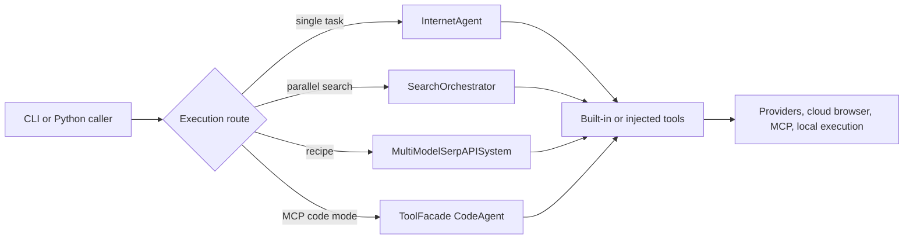

# Agentic Internet Code Wiki

Agentic Internet is a Python 3.11+ package and Typer CLI that composes smolagents with web search/scraping, Browser Use Cloud, local code/data tools, MCP servers, and several orchestration strategies. It owns no database or server; runtime state is in memory and most effects cross into external providers or local executors.

Start with [System Architecture](architecture/overview.md) for dependency direction, runtime paths, state ownership, and the canonical code-execution trust comparison. The real runtime entrypoints are the installed `agentic-internet` script and `python -m agentic_internet`; root `main.py` is stale scaffolding.

## Main concepts

### Interfaces and agents

- [Command-Line Interface](interfaces/cli.md) documents every root and MCP command, exact routing, inert/prompt-only options, output files, and error/exit semantics.
- [Python API](interfaces/python-api.md) maps root/subpackage exports, result conventions, exceptions, and complete extension surfaces.
- [Internet and Research Agents](agents/internet-and-research.md) owns model initialization, default-tool gates, underlying agent selection, run/chat, and research history.
- [Specialized Agents](agents/specialized-agents.md) covers all browser, data, content, market, and technical-support convenience methods.

### Orchestration

- [K-LLM Use-Case Orchestration](orchestration/k-llm-use-cases.md) covers recipes, tool bundles, worker/model selection, SerpAPI tools, coordinator execution, JSON outcomes, and context memory.
- [Search Orchestrator](orchestration/search-orchestrator.md) covers named workers, thread-pool execution, partial failures, synthesis, history, and web-tool integration.
- [Code Mode](orchestration/code-mode.md) covers `ToolFacade`, discovery/execution meta-tools, local/E2B selection, and MCP use.

### Capability tools

- [Web Search, News, and Scraping](tools/web-search-and-scraping.md): SerpAPI/DDGS fallback, optional orchestration, HTTP extraction, and SSRF boundary.
- [Exa Search](tools/exa-search.md): semantic search/find-similar requests, content controls, and conditional registration.
- [Browser Automation](tools/browser-automation.md): synchronous, asynchronous, streaming, and nominal structured Browser Use Cloud behavior.
- [Code Execution and Data Analysis](tools/code-execution-and-data.md): AST policy, restricted namespace, pandas operations, and non-sandbox limitations.
- [MCP Integration](tools/mcp-integration.md): stdio/HTTP discovery, context lifetime, environment configuration, trust, and multi-server limits.

### Configuration and engineering

- [Settings and Models](configuration/settings-and-models.md) explains actual environment bindings, alias/provider/key/fallback order, duplicated model catalogs, and provider extension steps.
- [Testing and Operations](development/testing-and-operations.md) maps focused tests, local quality gates, examples, Python CI, and the scheduled privileged OpenWiki PR workflow.

## Runtime at a glance



*All routes ultimately combine a resolved model with tools; their coordination and trust guarantees differ.*

## Task routing

| Engineering intent | Canonical page | Owning source entrypoints or symbols | Focused tests | Minimal validation |
|---|---|---|---|---|
| Change ordinary CLI routing/output | [CLI](interfaces/cli.md) | `agentic_internet/cli.py:app`, command function | `test_cli_use_cases.py`, `test_cli_mcp.py` when relevant | `uv run python -m agentic_internet.cli --help` plus changed command test |
| Change base task/chat/research behavior | [Internet and Research Agents](agents/internet-and-research.md) | `InternetAgent`, `ResearchAgent` | Adjacent tool/model tests; direct core coverage is sparse | Focused suite plus `uv run pytest` |
| Add/change a public facade/export | [Python API](interfaces/python-api.md) | root/subpackage `__init__.py`, implementation class/factory | Implementation and import-surface test | `uv run pytest <focused>` and `uv build` |
| Add a specialized helper | [Specialized Agents](agents/specialized-agents.md) | `specialized_agents.py` class/method and exports | `test_specialized_agents.py` | `uv run pytest tests/test_specialized_agents.py` |
| Add a K-LLM recipe or bundle | [K-LLM](orchestration/k-llm-use-cases.md) | `BUILT_IN_USE_CASES`, `TOOL_BUNDLES`, `create_use_case_tool_inventory`, `setup_use_case_workers` | `test_use_cases.py`, `test_orchestration_runtime.py`, `test_cli_use_cases.py` | Run those three files |
| Change coordinator/context behavior | [K-LLM](orchestration/k-llm-use-cases.md) | `execute_multi_model_workflow`, context classes | `test_context_engineering.py`; end-to-end gap remains | Focused context tests plus mocked workflow test you add |
| Change parallel search/synthesis | [Search Orchestrator](orchestration/search-orchestrator.md) | `SearchAgentWrapper`, `SearchOrchestrator.search`, `_aggregate_results` | `test_search_orchestrator.py` | Run that file; add `test_web_search.py` for integration |
| Change Code Mode/facade | [Code Mode](orchestration/code-mode.md) | `ToolFacade`, `ExecuteTool`, `create_code_mode_agent` | `test_code_mode.py`, `test_cli_mcp.py` | Run both files |
| Change web/news/scraping | [Web Tools](tools/web-search-and-scraping.md) | `_search_with_fallback`, tool `forward` methods, `_validate_url` | `test_web_search.py` | Run that file |
| Change Exa support | [Exa Search](tools/exa-search.md) | `ExaResult`, `ExaSearchTool`, `ExaFindSimilarTool`, default registration | `test_exa_search.py` | Run that file |
| Change Browser Use behavior | [Browser Automation](tools/browser-automation.md) | three Browser Use tool classes | `test_browser_use.py` | Run focused file; mark live test `integration` |
| Change local execution/data policy | [Code Execution](tools/code-execution-and-data.md) | `_ASTSafetyValidator`, `PythonExecutorTool`, `DataAnalysisTool` | `test_code_execution.py` | Run that file and add abuse-case test |
| Change MCP transport/configuration | [MCP Integration](tools/mcp-integration.md) | `MCPToolIntegration`, `MCPServerConfig`, manager, `mcp_tools`, environment loader | `test_mcp_integration.py`, `test_cli_mcp.py` | Run both; use marked local-server test for lifecycle |
| Add/change model provider or alias | [Settings and Models](configuration/settings-and-models.md) | `ModelConfig`, `Settings` resolution methods, `_create_model_for_provider`, catalogs | `test_settings.py`, `test_model_utils.py`, `test_openrouter_models.py` | Run all three |
| Change tests, CI, or doc automation | [Testing and Operations](development/testing-and-operations.md) | `pyproject.toml`, `Makefile`, both workflow YAML files | Repository suite/harness | `make check`; inspect workflow permissions and secrets |

## Safety and result conventions

- `PythonExecutorTool`, Code Mode, ordinary CodeAgents, and K-LLM CodeAgents have different policies; none is a complete arbitrary-code sandbox. Read the [canonical comparison](architecture/overview.md#canonical-code-execution-trust-comparison).
- Web scraping does not block internal/private/DNS-rebound targets. MCP stdio inherits the full parent environment and MCP trust is enforced differently by CLI routes.
- Many execution/provider failures are returned as strings or JSON text rather than raised. Validate semantic outcome, not only Python type or process status.
- The global settings object snapshots environment at import. `.env.example` includes several model/log variables that current Pydantic code does not bind.

## Repository-wide validation

For broad changes:

```bash
uv run ruff format --check agentic_internet tests
uv run ruff check agentic_internet tests
uv run mypy agentic_internet
uv run pytest
python3 .opencode/tools/golden_principles.py
```

External provider/browser/MCP checks should be explicitly marked integration, use placeholders or scoped test credentials, avoid configuration dumps, and clean up remote/process resources.

## Backlog

No substantial manifest-backed component was deferred. Live provider behavior and resource-isolation guarantees are documented as test gaps because they require external credentials/services or a dedicated sandbox fixture; their source anchors and narrow next checks are recorded on the owning tool/orchestration pages.