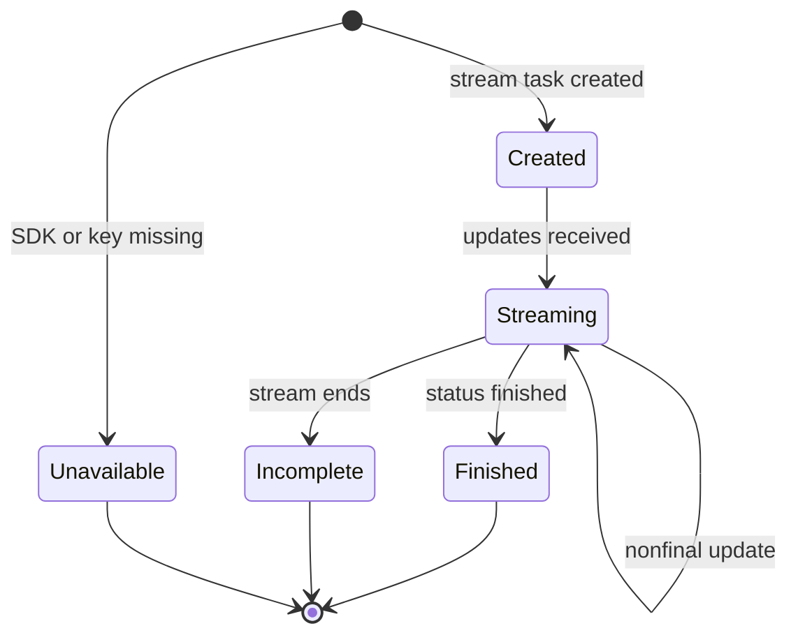

# Browser Automation

`agentic_internet/tools/browser_use.py` exports three Browser Use Cloud adapters. [InternetAgent](../agents/internet-and-research.md) registers them only when browser tools are enabled and `BROWSER_USE_API_KEY` is present.

| Tool | Client and behavior |
|---|---|
| `BrowserUseTool` / `browser_use` | Persistent `BrowserUse` client; `tasks.run(task=...)`; returns `done_output` or status text. Its `structured_output` input is ignored. |
| `AsyncBrowserUseTool` / `async_browser_use` | Persistent `AsyncBrowserUse`; `forward` invokes `asyncio.run`. Simple mode awaits `tasks.run`; stream mode creates a task, iterates updates, accumulates last-step text, and returns final output at status `finished` or an incomplete-stream message. |
| `StructuredBrowserUseTool` / `structured_browser_use` | Uses `AsyncBrowserUse` via `asyncio.run`, but does not parse or enforce the supplied JSON-schema string; it returns normal `done_output` or `No structured data extracted.` |

*The async streaming tool recognizes only SDK updates and final status; it has no repository-level timeout or cancellation state.*

The module’s `WebArticle`, `ProductInfo`, `ContactInfo`, and `SearchResults` Pydantic models are examples only and are not bound to tool output. Missing SDK/key and all SDK exceptions become strings.

## Lifecycle and trust

Clients have no explicit close/context-manager integration. `asyncio.run` fails inside an already-running event-loop thread; that failure is converted to a tool error. There is no timeout, retry, task cancellation/cleanup, polling bound, schema/task size check, URL policy, or buffered-step bound. Task content and accessed-site data cross the Browser Use Cloud trust boundary; SDK error details return to the model.

## Extension and validation

Override `_run_simple`, `_run_with_stream`, or `_extract_structured_data` for alternate lifecycle behavior. Real structured support must parse/validate the schema, pass the provider’s supported structured contract, and validate returned data rather than merely renaming the tool.

`tests/test_browser_use.py` covers sync no-key, successful output, status fallback, SDK error, and no-key behavior for async/structured tools. Async success/stream transitions, schema handling, ignored inputs, event-loop conflict, timeout, and client cleanup are untested. Run that file; use a separately marked integration test for live cloud behavior.