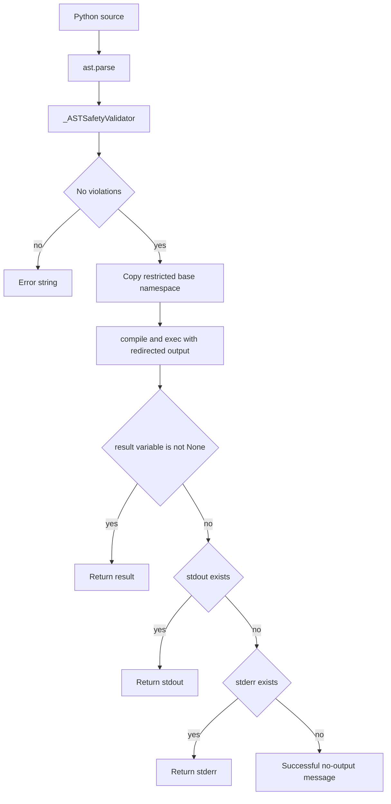

# Code Execution and Data Analysis

`agentic_internet/tools/code_execution.py` exports two smolagents tools: `PythonExecutorTool` and `DataAnalysisTool`. They are default capabilities when `settings.tools.code_execution_enabled` and also enter the K-LLM tool inventory. They are separate from CodeAgent/Code Mode execution; compare all paths in [System Architecture](../architecture/overview.md).

## PythonExecutorTool

*AST policy runs before a fresh execution namespace; output precedence is result, stdout, stderr, then status.*

The validator blocks selected module roots (`os`, subprocess/filesystem/socket/reflection/serialization families), dangerous direct calls (`eval`, `exec`, `compile`, `open`, `__import__`, reflection), and major dunder traversal attributes. The namespace exposes restricted builtins plus preloaded NumPy, pandas, requests, JSON, regex/date/time/math/statistics/collections utilities. Syntax/unsafe/runtime errors become strings; runtime errors include traceback text. Final output is capped at 10,000 characters.

This is defense in depth, **not a sandbox**. `PythonExecutorTool.EXECUTION_TIMEOUT_HINT = 30` is advisory documentation only and is never enforced. CPU, memory, process/thread, wall time, and network are unrestricted; preloaded `requests` enables outbound/internal requests. Rich library objects expand attack surface. Imports allowed by AST can still fail because `__import__` is absent. Fresh namespace copies isolate user bindings, not shared module objects, and output truncation occurs after execution.

## DataAnalysisTool

Inputs are `data` text and an operation. Supported operations are `describe`, `info`, `correlations`, `summary`, and `missing`; unknown operations return a message before parsing. The tool first tries JSON into `pandas.DataFrame`, then CSV on JSON/value failure. Results are text. Correlations reject data without numeric columns. There are no input-byte, row, nesting, memory, or execution-time limits.

## Policy changes and tests

Policy seams are allow/block constants, `_ASTSafetyValidator`, `_validate_code`, namespace construction, and output limits. Any relaxation needs an abuse-case test; do not infer safety from an AST allowlist alone. For untrusted code, use an externally enforced container/remote sandbox with network and resource policy.

`tests/test_code_execution.py` checks safe code; blocked OS/subprocess/ctypes, dunder, eval/exec/open paths; stdout/result/preloaded modules; syntax/runtime errors; final truncation; JSON/CSV and all data operations. It does not prove timeout, resource/network isolation, import-runtime consistency, or shared-object safety. Run `uv run pytest tests/test_code_execution.py`.