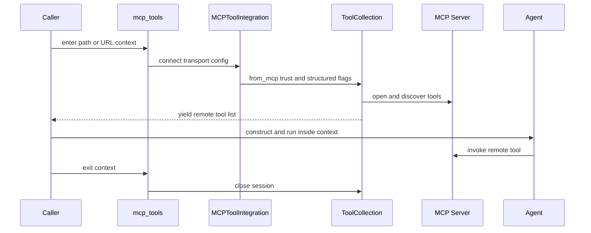

# MCP Integration

`agentic_internet/tools/mcp_integration.py` bridges smolagents `ToolCollection.from_mcp` to local stdio and remote streamable HTTP servers. MCP tools are not defaults; CLI routes or consumers open a context and inject discovered tools into [InternetAgent](../agents/internet-and-research.md) or [Code Mode](../orchestration/code-mode.md).

## Availability and exports

MCP is available only when both `mcp.StdioServerParameters` and `smolagents.ToolCollection` import. `check_mcp_available` raises `MCPNotAvailableError`; `is_mcp_available` returns a boolean. `agentic_internet.tools` conditionally exposes `MCP_AVAILABLE`, integration/config/manager types, `mcp_tools`, environment loading, and the boolean helper; failed import leaves safe false/`None` placeholders. Root `agentic_internet` does not export MCP APIs.

## Connection lifecycle

*Discovery and every remote invocation must finish before context exit.*

For stdio, configuration may be a path or `{path, command}`. The path is resolved absolute, command defaults to `python`, and supplied overrides merge into a copy of **all** `os.environ`; a child can therefore receive unrelated secrets. Existence/type/permissions/allowlisted command are not validated.

HTTP accepts `streamable-http` or `http`, normalizes a root URL to `/mcp/`, and passes `{"url": ..., "transport": "streamable-http"}`. Scheme, embedded credentials, private hosts, headers/auth, and TLS policy are not validated. If helper receives both path and URL, path wins.

`connect(..., trust_remote_code, structured_output)` conditionally forwards structured output and yields `tool_collection.tools`. The integration API does not enforce trust: `mcp run` requires `--trust`, while `mcp test` unconditionally enables trust. Treat server code/tool descriptions/results as untrusted. Code Mode lets generated Python invoke every nonreserved remote tool, amplifying effects.

## Configuration and manager

`MCPServerConfig` round-trips name, server config, transport, environment, trust, and structured flags. `MCPServerManager` stores configs, overwrites duplicate names, and opens connections on demand. `connect_all` fully supports zero, one, or exactly two servers; for more than two it warns and yields only the first server’s tools.

`load_mcp_config_from_env` scans contiguous `MCP_SERVER_1_*`, `MCP_SERVER_2_*`, etc. It stops at the first missing `TYPE`, so numbering gaps hide later entries. Stdio requires `PATH` and captures `ENV_*`; HTTP requires `URL`; trust/structured booleans accept true/1/yes. Invalid entries warn and skip.

The instance fields `_context_manager` and `_tools` are not populated by current classmethod connection flow, so `get_tools_list()` ordinarily remains empty.

## CLI and extension checks

`mcp list` shows environment configs; `info` explains support; `run` selects stdio/HTTP and tool-calling/code agent; `test` discovers and displays tools. See [CLI](../interfaces/cli.md) for option/error behavior. Example files demonstrate use but require external dependencies/server processes; `example_mcp_server.py` imports undeclared `fastmcp`.

`tests/test_mcp_integration.py` covers availability, exports, config round-trip, manager storage, parameter shapes, and basic environment loading; many cases skip without MCP. `tests/test_cli_mcp.py` pins Code Mode/structured-output routing. There is no live context/cleanup, URL normalization/security, arbitrary command/environment leak, numbering-gap, connection failure, or >2-server test. Use a marked local-server integration fixture before changing lifecycle semantics.