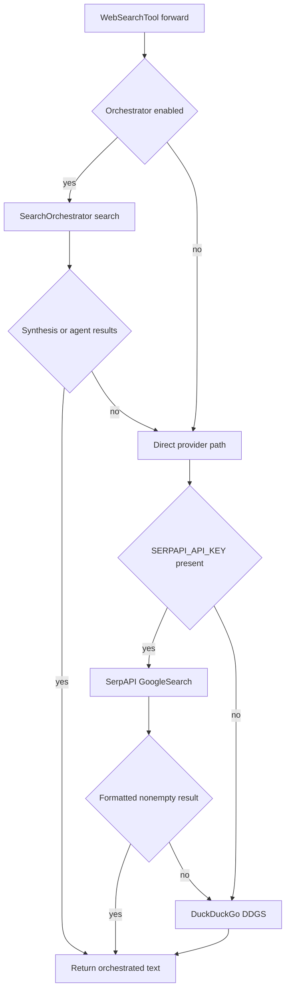

# Web Search, News, and Scraping

`agentic_internet/tools/web_search.py` owns three `smolagents.Tool` classes exported from `agentic_internet.tools`: `WebSearchTool`, `WebScraperTool`, and `NewsSearchTool`. [InternetAgent](../agents/internet-and-research.md) registers them when web search is enabled; K-LLM creates them independently in its use-case inventory.

## Search fallback

*Orchestration and SerpAPI failures degrade to DuckDuckGo rather than raising.*

`WebSearchTool` accepts `query`; direct results are numbered title/snippet/URL text, limited by helper default `num=5` (and SerpAPI slices to that count). Optional `use_orchestrator` plus an injected [SearchOrchestrator](../orchestration/search-orchestrator.md) prefers a `**Orchestrated Search Results (Synthesized):**` response, then per-agent output; an exception or no usable synthesis/results logs and enters direct fallback. `NewsSearchTool` accepts `query` and uses SerpAPI `tbm="nws"` or `DDGS.news(..., max_results=5)`. Search tools read `SERPAPI_API_KEY` directly; `ToolConfig.max_search_results` is not wired into them.

SerpAPI unavailable, missing key, empty provider list, or exception produces internal `None` and therefore DDGS fallback. DDGS absence returns exactly `DuckDuckGo search is not available. Install with: pip install duckduckgo-search`; an empty list returns `No search results found.`; provider failure returns `Error performing DuckDuckGo search: <detail>`. There is no retry, caching, backoff, or rate-limit policy.

## Scraper lifecycle

`WebScraperTool.forward(url)` validates only an `http` or `https` scheme with a nonempty network location. It creates an `httpx.Client(follow_redirects=True, timeout=30)`, sends a browser-like user agent, raises on status, parses with BeautifulSoup, removes script/style nodes, collapses whitespace, and truncates extracted text to 3,000 characters. HTTP and general failures become explanatory strings.

Success returns `Content from <url>:\n\n<text>`. URL policy returns `Invalid URL scheme '<scheme>'. Only http and https are supported.`, `Invalid URL: missing hostname.`, or `Malformed URL: <url>`. HTTP status failures return `HTTP error <status> when accessing <url>`, and other failures return `Error scraping <url>: <detail>`.

Security boundary: this is not SSRF-safe. Validation checks only scheme and hostname syntax. It does not reject `localhost`, loopback, private, link-local, or metadata targets; protect against DNS rebinding; revalidate redirect targets; restrict content type; or bound response/download bytes before parsing. Do not expose it to arbitrary untrusted URLs in a privileged network without an outbound proxy and address policy.

## Extension and validation

Provider formatting/fallback lives in `_search_serpapi`, `_search_ddgs`, and `_search_with_fallback`; URL syntax policy is `_validate_url`. If adding a search provider, preserve deterministic fallback semantics and distinguish unavailable, empty, and failed outcomes. If hardening scraping, test initial and redirect addresses, DNS resolution, content type/size, and timeout behavior.

Focused proof in `tests/test_web_search.py` includes `TestSearchWithFallback::test_falls_back_to_ddgs`, `TestValidateUrl::test_invalid_scheme`, `TestWebScraperTool::test_rejects_ftp_url`, `TestWebScraperTool::test_successful_scrape`, and `TestNewsSearchTool::test_forward_uses_news_params`; adjacent cases cover SerpAPI empty/unavailable/error and DDGS formatting/unavailability. It does not cover orchestrator branches, news formatting, redirect/SSRF/DNS policy, script removal, truncation, status errors, or download bounds. Run this suite plus `tests/test_search_orchestrator.py` when altering orchestration.