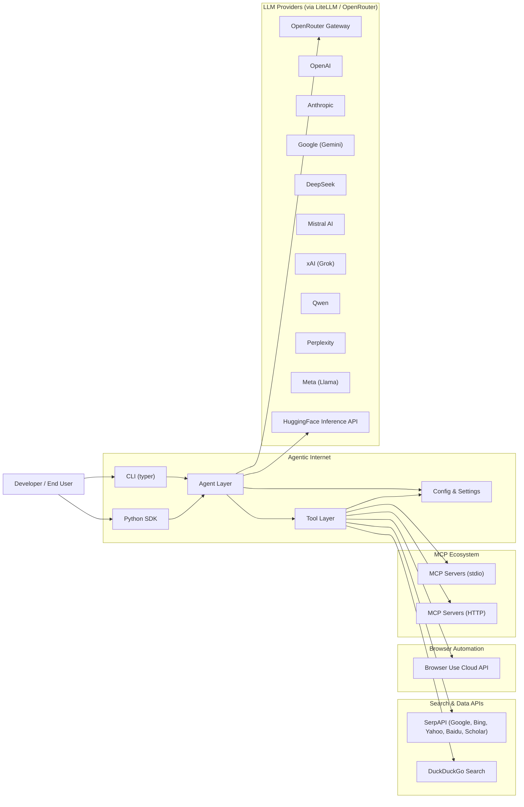
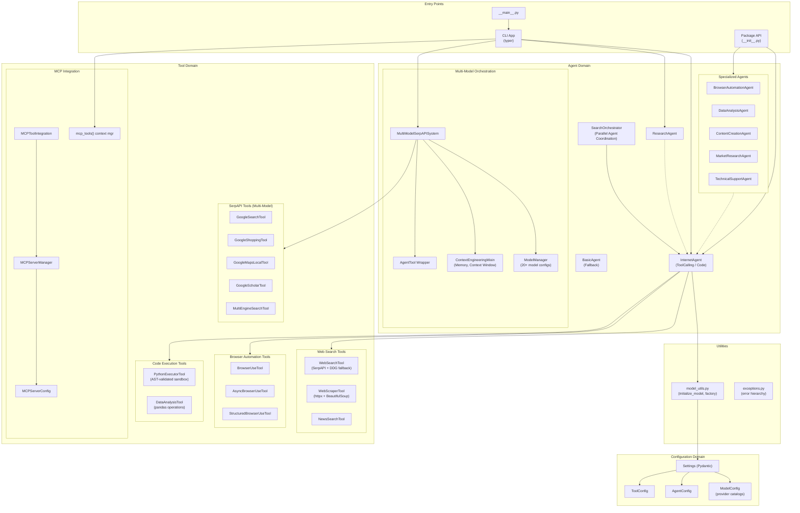
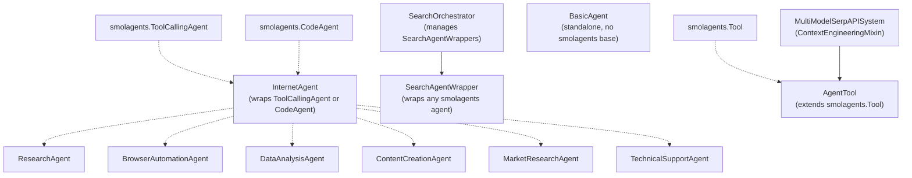
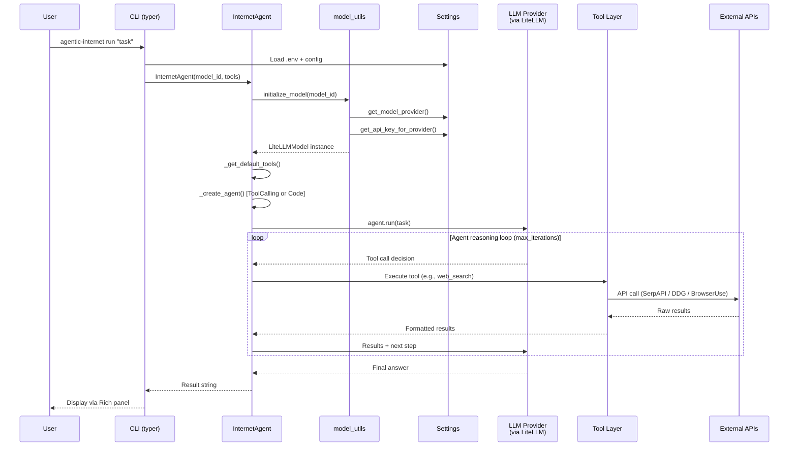
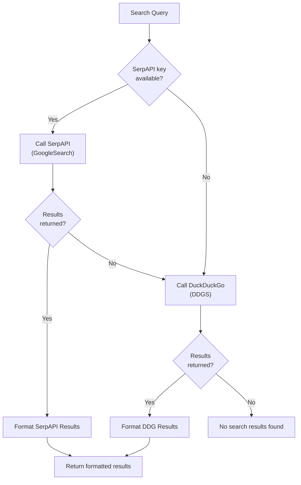
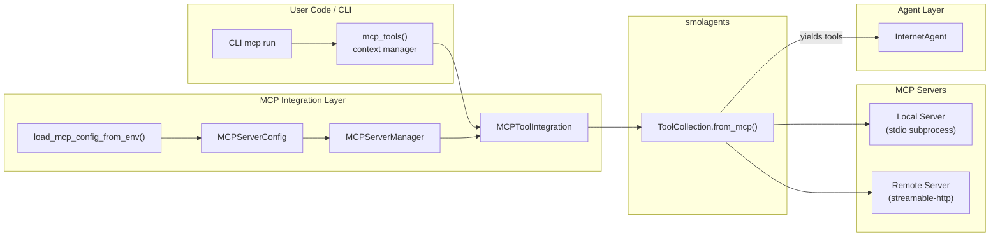
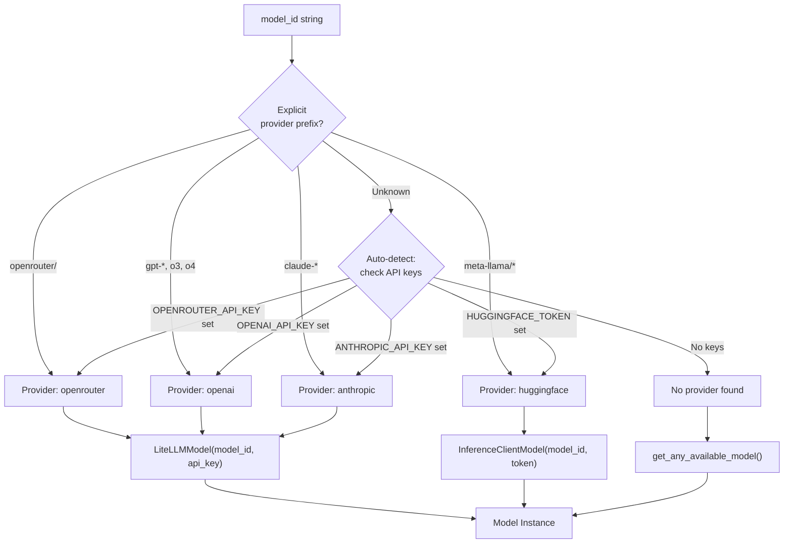
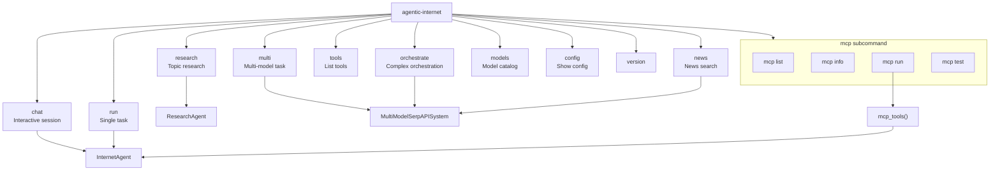
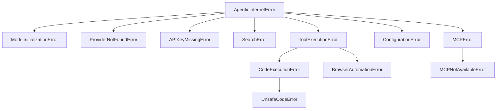

# Agentic Internet - Codebase Architecture Diagrams

> Generated: 2026-02-23
> Codebase version: 0.1.0

---

## 1. System Context Diagram (Executive View)

High-level view of Agentic Internet, its users, and external dependencies.

### Legend

| Symbol | Meaning |
|--------|---------|
| Rectangle | Internal module or component |
| Rounded rectangle | External system or service |
| Arrow | Runtime dependency / data flow |
| Subgraph | Domain boundary |

### Code Anchors

| Node | Path |
|------|------|
| `cli` | `agentic_internet/cli.py` |
| `agents` | `agentic_internet/agents/` |
| `tools` | `agentic_internet/tools/` |
| `config` | `agentic_internet/config/settings.py` |

---

## 2. Codebase Architecture Diagram (Feature/Domain Level)

Internal architecture showing the major domains and their interconnections.

### Legend

| Symbol | Meaning |
|--------|---------|
| Solid arrow (`-->`) | Direct runtime call / dependency |
| Dashed arrow (`-.->`) | Inheritance relationship |
| Subgraph | Feature domain boundary |
| ` ` in labels | Supplementary info about the node |

### Code Anchors

| Node | Path |
|------|------|
| `cli_app` | `agentic_internet/cli.py` |
| `py_main` | `agentic_internet/__main__.py` |
| `pkg_init` | `agentic_internet/__init__.py` |
| `internet_agent` | `agentic_internet/agents/internet_agent.py:28` (class InternetAgent) |
| `research_agent` | `agentic_internet/agents/internet_agent.py:254` (class ResearchAgent) |
| `basic_agent` | `agentic_internet/agents/basic_agent.py:12` (class BasicAgent) |
| `browser_agent` | `agentic_internet/agents/specialized_agents.py:13` |
| `data_agent` | `agentic_internet/agents/specialized_agents.py:100` |
| `content_agent` | `agentic_internet/agents/specialized_agents.py:173` |
| `market_agent` | `agentic_internet/agents/specialized_agents.py:243` |
| `tech_agent` | `agentic_internet/agents/specialized_agents.py:325` |
| `search_orch` | `agentic_internet/agents/search_orchestrator.py:119` (class SearchOrchestrator) |
| `model_manager` | `agentic_internet/agents/multi_model_serpapi.py:32` (class ModelManager) |
| `mm_system` | `agentic_internet/agents/multi_model_serpapi.py:914` (class MultiModelSerpAPISystem) |
| `context_eng` | `agentic_internet/agents/multi_model_serpapi.py:783` (class ContextEngineeringMixin) |
| `agent_tool_wrap` | `agentic_internet/agents/multi_model_serpapi.py:762` (class AgentTool) |
| `web_search` | `agentic_internet/tools/web_search.py:110` |
| `web_scraper` | `agentic_internet/tools/web_search.py:184` |
| `news_search` | `agentic_internet/tools/web_search.py:238` |
| `bu_sync` | `agentic_internet/tools/browser_use.py:21` |
| `bu_async` | `agentic_internet/tools/browser_use.py:74` |
| `bu_structured` | `agentic_internet/tools/browser_use.py:150` |
| `py_executor` | `agentic_internet/tools/code_execution.py:162` |
| `data_analysis` | `agentic_internet/tools/code_execution.py:259` |
| `g_search` | `agentic_internet/agents/multi_model_serpapi.py:390` |
| `g_shopping` | `agentic_internet/agents/multi_model_serpapi.py:470` |
| `g_maps` | `agentic_internet/agents/multi_model_serpapi.py:540` |
| `g_scholar` | `agentic_internet/agents/multi_model_serpapi.py:593` |
| `multi_engine` | `agentic_internet/agents/multi_model_serpapi.py:646` |
| `mcp_integration` | `agentic_internet/tools/mcp_integration.py:53` |
| `mcp_manager` | `agentic_internet/tools/mcp_integration.py:255` |
| `mcp_config` | `agentic_internet/tools/mcp_integration.py:216` |
| `mcp_convenience` | `agentic_internet/tools/mcp_integration.py:402` |
| `settings` | `agentic_internet/config/settings.py:161` (class Settings) |
| `model_config` | `agentic_internet/config/settings.py:15` (class ModelConfig) |
| `agent_config` | `agentic_internet/config/settings.py:139` |
| `tool_config` | `agentic_internet/config/settings.py:150` |
| `model_utils` | `agentic_internet/utils/model_utils.py` |
| `exceptions` | `agentic_internet/exceptions.py` |

---

## 3. Agent Inheritance & Type Hierarchy

Shows how the different agent types relate to each other.

### Legend

| Symbol | Meaning |
|--------|---------|
| Dashed arrow (`-.->`) | Inheritance (extends / wraps) |
| Solid arrow (`-->`) | Composition (creates / manages) |

---

## 4. Multi-Model Orchestration Flow

Shows how the `MultiModelSerpAPISystem` coordinates multiple LLM models and worker agents.

```mermaid
flowchart LR
    subgraph user_input["User Input"]
        task["Task String"]
    end

    subgraph orchestration["MultiModelSerpAPISystem"]
        mm["MultiModelSerpAPISystem"]
        ctx["ContextEngineeringMixin<br/>(Memory + Context Window)"]
        mgr["ModelManager<br/>(20+ LLM configs)"]

        mm --> ctx
        mm --> mgr
    end

    subgraph workers["Specialized Worker Agents"]
        w_search["search_researcher<br/>(Sonar Pro)"]
        w_ecom["ecommerce_analyst<br/>(Gemini Pro)"]
        w_local["local_business_analyst<br/>(Mistral Large)"]
        w_acad["academic_researcher<br/>(Sonar Reasoning)"]
    end

    subgraph orchestrator_agent["Orchestrator Agent"]
        orch_code["CodeAgent<br/>(Claude Opus 4.5)"]
    end

    subgraph serpapi["SerpAPI Tools"]
        st_google["GoogleSearchTool"]
        st_shop["GoogleShoppingTool"]
        st_maps["GoogleMapsLocalTool"]
        st_scholar["GoogleScholarTool"]
        st_multi["MultiEngineSearchTool"]
    end

    subgraph result_output["Output"]
        result["JSON Result<br/>(primary + performance + cross-engine)"]
    end

    task --> mm
    mgr --> |"assigns models"| workers
    mgr --> |"assigns model"| orch_code
    mm --> |"wraps as AgentTool"| workers
    mm --> |"provides SerpAPI tools"| orch_code
    workers -.-> |"wrapped as tools"| orch_code
    orch_code --> |"delegates subtasks"| workers
    workers --> serpapi
    orch_code --> result
```

### Legend

| Symbol | Meaning |
|--------|---------|
| Solid arrow | Data flow / runtime call |
| Dashed arrow | Tool delegation |
| Parenthetical text | Default model assignment |

### Code Anchors

| Node | Path |
|------|------|
| `mm` | `agentic_internet/agents/multi_model_serpapi.py:914` |
| `mgr` | `agentic_internet/agents/multi_model_serpapi.py:32` |
| `ctx` | `agentic_internet/agents/multi_model_serpapi.py:783` |
| Worker creation | `agentic_internet/agents/multi_model_serpapi.py:1120` (`setup_multi_model_workers`) |
| Orchestration entry | `agentic_internet/agents/multi_model_serpapi.py:1178` (`execute_multi_model_workflow`) |

---

## 5. Request Lifecycle (Single Agent Task)

Shows the flow from CLI invocation through agent execution to result.

### Code Anchors

| Step | Path |
|------|------|
| CLI `run` command | `agentic_internet/cli.py:61` |
| `InternetAgent.__init__` | `agentic_internet/agents/internet_agent.py:33` |
| `initialize_model` | `agentic_internet/utils/model_utils.py:60` |
| `_get_default_tools` | `agentic_internet/agents/internet_agent.py:112` |
| `InternetAgent.run` | `agentic_internet/agents/internet_agent.py:148` |

---

## 6. Tool Selection & Fallback Strategy

Shows how the web search tools use SerpAPI with DuckDuckGo fallback.

### Code Anchors

| Node | Path |
|------|------|
| `_search_with_fallback` | `agentic_internet/tools/web_search.py:99` |
| `_search_serpapi` | `agentic_internet/tools/web_search.py:26` |
| `_search_ddgs` | `agentic_internet/tools/web_search.py:66` |

---

## 7. MCP Integration Architecture

Shows how MCP servers connect to the agent system.

### Code Anchors

| Node | Path |
|------|------|
| `mcp_ctx` | `agentic_internet/tools/mcp_integration.py:402` |
| `mcp_int` | `agentic_internet/tools/mcp_integration.py:53` |
| `mcp_mgr` | `agentic_internet/tools/mcp_integration.py:255` |
| `mcp_cfg` | `agentic_internet/tools/mcp_integration.py:216` |
| `env_loader` | `agentic_internet/tools/mcp_integration.py:453` |
| CLI `mcp run` | `agentic_internet/cli.py:718` |

---

## 8. Configuration & Provider Resolution

How model provider is resolved and API keys are matched.

### Code Anchors

| Node | Path |
|------|------|
| `get_model_provider` | `agentic_internet/config/settings.py:208` |
| `_create_model_for_provider` | `agentic_internet/utils/model_utils.py:19` |
| `initialize_model` | `agentic_internet/utils/model_utils.py:60` |
| `get_any_available_model` | `agentic_internet/utils/model_utils.py:95` |

---

## 9. CLI Command Map

Overview of all CLI commands and their relationships to internal components.

### Code Anchors

| Command | Path |
|---------|------|
| `chat` | `agentic_internet/cli.py:30` |
| `run` | `agentic_internet/cli.py:61` |
| `research` | `agentic_internet/cli.py:104` |
| `multi` | `agentic_internet/cli.py:196` |
| `orchestrate` | `agentic_internet/cli.py:293` |
| `tools` | `agentic_internet/cli.py:364` |
| `news` | `agentic_internet/cli.py:410` |
| `models` | `agentic_internet/cli.py:503` |
| `config` | `agentic_internet/cli.py:160` |
| `version` | `agentic_internet/cli.py:885` |
| `mcp list` | `agentic_internet/cli.py:627` |
| `mcp info` | `agentic_internet/cli.py:676` |
| `mcp run` | `agentic_internet/cli.py:718` |
| `mcp test` | `agentic_internet/cli.py:814` |

---

## 10. Exception Hierarchy

### Code Anchors

| Exception | Path |
|-----------|------|
| All exceptions | `agentic_internet/exceptions.py` |

---

## Unknowns / Assumptions

| Item | Status | Verification |
|------|--------|-------------|
| No database or persistent storage detected | Confirmed | All state is in-memory (AgentMemory, ContextWindow). No DB drivers in dependencies. |
| No message queue or event bus | Confirmed | ThreadPoolExecutor used for parallel agents; asyncio for async flows. No Kafka/Redis/SQS. |
| smolagents is the core framework | Confirmed | All agents wrap `ToolCallingAgent`, `CodeAgent`, or `BasicAgent` from smolagents. |
| OpenRouter is the primary LLM gateway | Assumed | Default model is `openrouter/anthropic/claude-opus-4.5`. Most model configs route through OpenRouter. Direct provider keys are fallbacks. |
| SerpAPI tools live in `multi_model_serpapi.py` rather than `tools/` | Confirmed | Google Search/Shopping/Maps/Scholar/MultiEngine tools are defined alongside the multi-model system, not in the tools package. This is an architectural coupling. |
| No authentication or user management | Confirmed | CLI is single-user. No auth middleware or user model. |
| Examples directory is documentation-only | Confirmed | `agentic_internet/examples/` contains usage examples, not tested application code. |
